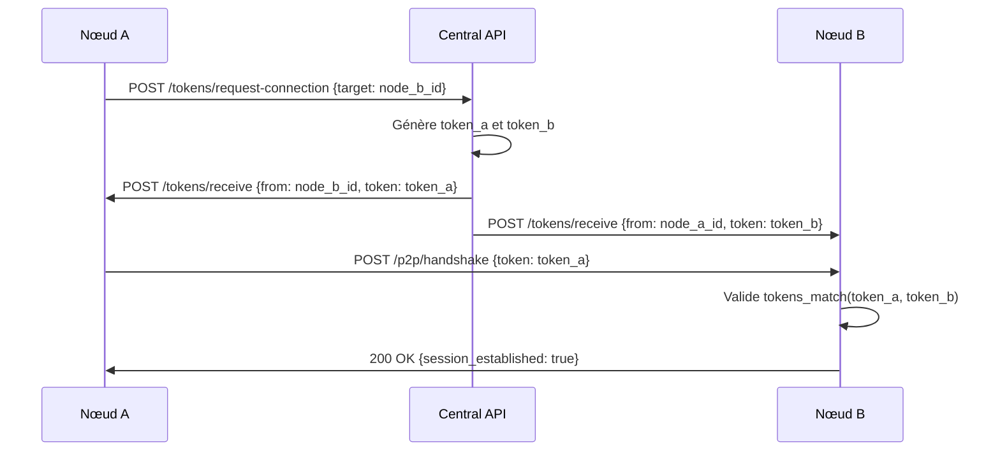
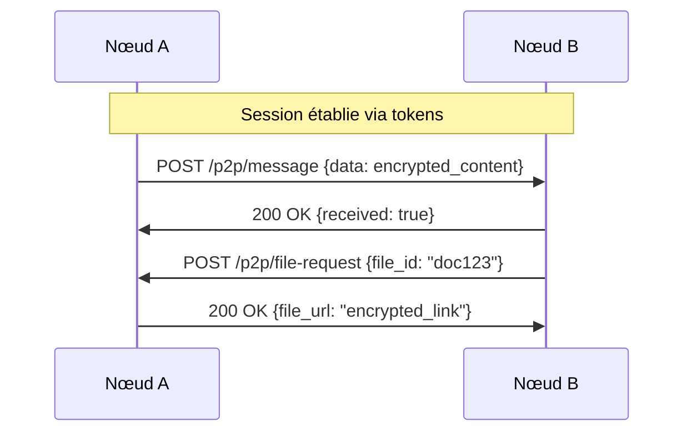

# 🚀 OpenRed v3.0 - Architecture Décentralisée Avancée

## 📋 Vue d'ensemble

OpenRed v3.0 adopte une architecture **ultra-décentralisée** où l'API centrale sert uniquement d'**annuaire de découverte**, tandis que chaque nœud gère sa propre sécurité, cryptographie et communications directes.

## 🏗️ Architecture Générale

```
┌─────────────────────────────────────────────────────────────────┐
│                    OPENRED CENTRAL API                         │
│                   (Annuaire Minimal)                           │
│  ┌─────────────────────────────────────────────────────────┐   │
│  │ • ID des nœuds                                          │   │
│  │ • URLs des APIs nœuds                                   │   │
│  │ • Service de génération de tokens temporaires          │   │
│  │ • Routage des tokens vers les nœuds                    │   │
│  └─────────────────────────────────────────────────────────┘   │
└─────────────────────────────────────────────────────────────────┘
                                   │
                                   │ Distribution des tokens
                                   │
              ┌────────────────────┼────────────────────┐
              │                    │                    │
              ▼                    ▼                    ▼
    ┌─────────────────┐  ┌─────────────────┐  ┌─────────────────┐
    │   NŒUD A        │  │   NŒUD B        │  │   NŒUD C        │
    │                 │  │                 │  │                 │
    │ ┌─────────────┐ │  │ ┌─────────────┐ │  │ ┌─────────────┐ │
    │ │ Crypto Core │ │  │ │ Crypto Core │ │  │ │ Crypto Core │ │
    │ │   Module    │ │  │ │   Module    │ │  │ │   Module    │ │
    │ └─────────────┘ │  │ └─────────────┘ │  │ └─────────────┘ │
    │ ┌─────────────┐ │  │ ┌─────────────┐ │  │ ┌─────────────┐ │
    │ │   Token     │ │  │ │   Token     │ │  │ │   Token     │ │
    │ │  Manager    │ │  │ │  Manager    │ │  │ │  Manager    │ │
    │ └─────────────┘ │  │ └─────────────┘ │  │ └─────────────┘ │
    │ ┌─────────────┐ │  │ ┌─────────────┐ │  │ ┌─────────────┐ │
    │ │   P2P API   │ │  │ │   P2P API   │ │  │ │   P2P API   │ │
    │ └─────────────┘ │  │ └─────────────┘ │  │ └─────────────┘ │
    └─────────────────┘  └─────────────────┘  └─────────────────┘
              │                    │                    │
              └────────────────────┼────────────────────┘
                                   │
                      Communications P2P directes
```

## 🎯 Composants Principaux

### 1. **OpenRed Central API** (Ultra-minimaliste)

#### 📋 Responsabilités
- **Annuaire** : Stockage ID nœuds ↔ URLs APIs
- **Génération de tokens** : Création de tokens temporaires pour établissement de liaison
- **Distribution** : Envoi automatique des tokens aux nœuds concernés
- **Aucun stockage** : Pas de tokens, pas de données utilisateur

#### 💾 Structure de données
```python
{
    "nodes": {
        "node_a_id": {
            "api_url": "https://node-a.example.com/api",
            "last_seen": "2025-09-22T10:30:00Z",
            "status": "active"
        },
        "node_b_id": {
            "api_url": "https://node-b.example.com/api", 
            "last_seen": "2025-09-22T10:25:00Z",
            "status": "active"
        }
    }
}
```

#### 🔄 API Endpoints
```
POST /api/v3/nodes/register
POST /api/v3/tokens/request-connection
GET  /api/v3/nodes/discover
GET  /api/v3/health
```

### 2. **Nœuds OpenRed** (Autonomes et sécurisés)

#### 🏗️ Structure modulaire
```
openred-node/
├── core/
│   ├── crypto_engine/          # Moteur cryptographique
│   │   ├── methods/
│   │   │   ├── cipher_alpha.py    # Méthode crypto A
│   │   │   ├── cipher_beta.py     # Méthode crypto B
│   │   │   ├── cipher_gamma.py    # Méthode crypto C
│   │   │   └── cipher_factory.py  # Sélecteur de méthode
│   │   ├── token_processor.py     # Processeur de tokens
│   │   └── validator.py          # Validateur de tokens
│   ├── token_manager/          # Gestionnaire de tokens
│   │   ├── storage.py             # Stockage .env
│   │   ├── lifecycle.py           # Cycle de vie tokens
│   │   └── sync.py                # Synchronisation
│   └── p2p_api/               # API P2P
│       ├── routes.py              # Routes API
│       ├── middleware.py          # Middleware sécurité
│       └── handlers.py            # Gestionnaires
├── modules/
│   ├── messaging/             # Module messagerie
│   ├── file_sharing/          # Module partage fichiers
│   ├── authentication/        # Module auth avancée
│   └── monitoring/            # Module monitoring
├── venv/                      # Environnement virtuel principal
├── crypto_venv/               # Env virtuel crypto isolé
├── .env                       # Variables d'environnement
└── main.py                    # Point d'entrée
```

## 🔐 Système Cryptographique Innovant

### 1. **Génération de tokens asymétriques**

#### 🎲 Principe de base
Chaque token est généré avec deux variations cryptographiques différentes mais mathématiquement liées.

#### 🔄 Processus de génération
```python
def generate_asymmetric_tokens(node_a_id, node_b_id, timestamp):
    """
    Génère deux tokens différents mais cryptographiquement liés
    """
    # Base commune secrète
    base_secret = sha256(f"{node_a_id}:{node_b_id}:{timestamp}").digest()
    
    # Token pour nœud A
    token_a = transform_with_node_salt(base_secret, node_a_id, "variant_alpha")
    
    # Token pour nœud B  
    token_b = transform_with_node_salt(base_secret, node_b_id, "variant_beta")
    
    return token_a, token_b
```

#### 🧮 Méthodes de transformation
1. **XOR avec salt unique** : `token ⊕ node_salt`
2. **Rotation circulaire** : Décalage bits basé sur node_id
3. **Permutation contrôlée** : Réarrangement bytes selon algorithme
4. **Hash en cascade** : Multiple hashage avec seeds différents

### 2. **Validation croisée**

#### 🔍 Principe de reconnaissance
```python
def tokens_match(token_a, token_b, node_a_id, node_b_id, timestamp):
    """
    Vérifie si deux tokens différents proviennent de la même source
    """
    # Reconstruction du secret de base depuis token_a
    reconstructed_from_a = reverse_transform(token_a, node_a_id, "variant_alpha")
    
    # Reconstruction du secret de base depuis token_b  
    reconstructed_from_b = reverse_transform(token_b, node_b_id, "variant_beta")
    
    # Comparaison des secrets reconstruits
    return reconstructed_from_a == reconstructed_from_b
```

### 3. **Méthodes cryptographiques par époque**

#### 📅 Sélection temporelle
```python
def select_crypto_method(timestamp):
    """
    Sélectionne la méthode crypto selon la date/heure
    """
    hour = datetime.fromisoformat(timestamp).hour
    day = datetime.fromisoformat(timestamp).day
    
    # Exemple de sélection
    method_index = (hour + day) % NUMBER_OF_METHODS
    
    methods = ["cipher_alpha", "cipher_beta", "cipher_gamma", "cipher_delta"]
    return methods[method_index]
```

#### 🔄 Rotation des méthodes
- **Horaire** : Changement toutes les heures
- **Quotidienne** : Changement par jour de la semaine  
- **Aléatoire contrôlée** : Basée sur timestamp + seed

## 🔄 Flux de Communication

### 1. **Établissement de connexion**



### 2. **Communication P2P directe**



## 🛡️ Sécurité Avancée

### 1. **Isolation des environnements**

#### 🔒 Séparation crypto
```bash
# Environnement principal
/openred-node/venv/
├── FastAPI, SQLite, etc.

# Environnement crypto isolé  
/openred-node/crypto_venv/
├── Uniquement modules crypto
├── Pas d'accès réseau
├── Chroot jail possible
```

#### 🚧 Communication inter-env
```python
def crypto_operation(data, method):
    """
    Exécute opération crypto dans environnement isolé
    """
    # Communication via pipes/sockets Unix
    result = subprocess.run([
        "crypto_venv/bin/python", 
        "crypto_engine/processor.py",
        "--method", method,
        "--data", data
    ], capture_output=True, text=True)
    
    return result.stdout
```

### 2. **Gestion des tokens sécurisée**

#### 💾 Stockage .env chiffré
```python
# .env (chiffré au repos)
NODE_A_TOKEN_ABC123=encrypted:AES256:base64data
NODE_B_TOKEN_DEF456=encrypted:AES256:base64data
TOKEN_MASTER_KEY=derived_from_node_secret
```

#### 🔄 Rotation automatique
- **Expiration** : Tokens expirés automatiquement
- **Renouvellement** : Demande automatique avant expiration
- **Nettoyage** : Suppression tokens obsolètes

### 3. **Audit et monitoring**

#### 📊 Logging sécurisé
```python
# Logs chiffrés et signés
{
    "timestamp": "2025-09-22T10:30:00Z",
    "event": "token_validation", 
    "node_id": "hashed_node_id",
    "success": true,
    "signature": "crypto_signature"
}
```

## 📈 Performance et Scalabilité

### 1. **Optimisations**

#### ⚡ Cache intelligent
```python
# Cache tokens validés
token_cache = {
    "node_pair_hash": {
        "valid_until": timestamp,
        "crypto_method": "cipher_alpha",
        "validation_result": True
    }
}
```

#### 🔄 Pool de connexions
```python
# Pool connexions P2P réutilisables
connection_pool = {
    "node_id": persistent_connection,
    "max_connections": 100,
    "timeout": 300
}
```

### 2. **Évolutivité modulaire**

#### 🧩 Architecture plugin
```python
class OpenRedModule:
    def register_routes(self, app):
        pass
    
    def register_crypto_methods(self, crypto_engine):
        pass
        
    def register_middleware(self, app):
        pass

# Modules chargeables à chaud
modules = [
    MessagingModule(),
    FileSharingModule(), 
    AuthenticationModule(),
    CustomModule()
]
```

## 🚀 Modules Extensibles

### 1. **Module Messaging**
```python
# messaging/routes.py
@router.post("/p2p/message/send")
async def send_message(message: EncryptedMessage, token: str):
    # Validation token P2P
    # Chiffrement bout-en-bout
    # Routage direct
    pass
```

### 2. **Module File Sharing**
```python
# file_sharing/routes.py  
@router.post("/p2p/file/share")
async def share_file(file_request: FileShareRequest, token: str):
    # Validation permissions
    # Génération liens temporaires
    # Chiffrement fichiers
    pass
```

### 3. **Module Authentication**
```python
# authentication/routes.py
@router.post("/p2p/auth/challenge")
async def auth_challenge(challenge: AuthChallenge, token: str):
    # Multi-factor authentication
    # Biométrie optionnelle
    # Sessions sécurisées
    pass
```

## 📋 Avantages de cette Architecture

### ✅ **Sécurité**
- **Zero-trust** : Chaque nœud vérifie indépendamment
- **Crypto distribué** : Pas de point de défaillance unique
- **Isolation** : Modules crypto séparés
- **Tokens asymétriques** : Impossible à intercepter et réutiliser

### ✅ **Performance**  
- **P2P direct** : Pas de goulot d'étranglement central
- **Cache intelligent** : Validation rapide
- **Modules à la demande** : Charge uniquement le nécessaire

### ✅ **Scalabilité**
- **Décentralisé** : Croissance horizontale naturelle
- **Modulaire** : Ajout de fonctionnalités sans refactoring
- **Indépendant** : Chaque nœud autonome

### ✅ **Maintenance**
- **API centrale minimaliste** : Moins de bugs
- **Nœuds autonomes** : Mise à jour indépendante
- **Standards ouverts** : Interopérabilité

## 🎯 Prochaines Étapes

1. **Implémentation crypto core** : Système de tokens asymétriques
2. **API centrale v3** : Version ultra-minimaliste  
3. **Nœud prototype** : Premier nœud fonctionnel
4. **Modules de base** : Messaging + Authentication
5. **Tests P2P** : Validation communications directes
6. **Documentation** : Guide développeur modules

---

Cette architecture offre un équilibre optimal entre **sécurité**, **performance** et **simplicité**, tout en permettant une **évolutivité maximale** pour l'écosystème OpenRed.
