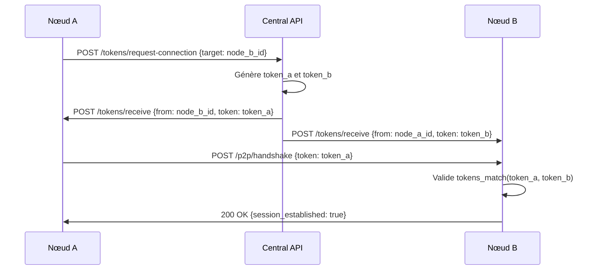
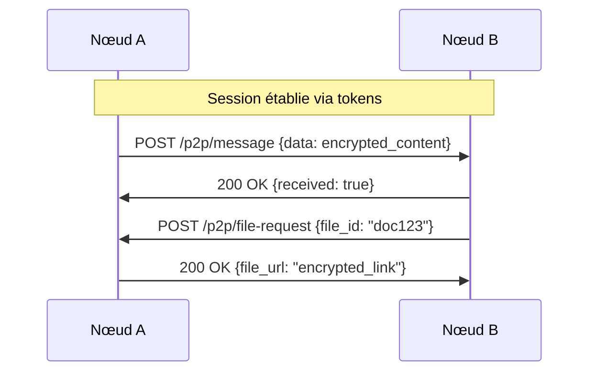

# 🚀 OpenRed v3.0 - Architecture Décentralisée Avancée

🌐 **Navigation Multilingue** | **Multilingual Navigation**
- [🇫🇷 Français](#français) | [🇺🇸 English](#english) | [🇪🇸 Español](#español) | [🇨🇳 中文](#中文)

---

## Français

# 🚀 OpenRed v3.0 - Architecture Décentralisée Avancée

## 📋 Vue d'ensemble

OpenRed v3.0 adopte une architecture **ultra-décentralisée** où l'API centrale sert uniquement d'**annuaire de découverte**, tandis que chaque nœud gère sa propre sécurité, cryptographie et communications directes.

## 🏗️ Architecture Générale

```
┌─────────────────────────────────────────────────────────────────┐
│                    OPENRED CENTRAL API                         │
│                   (Annuaire Minimal)                           │
│  ┌─────────────────────────────────────────────────────────┐   │
│  │ • ID des nœuds                                          │   │
│  │ • URLs des APIs nœuds                                   │   │
│  │ • Service de génération de tokens temporaires          │   │
│  │ • Routage des tokens vers les nœuds                    │   │
│  └─────────────────────────────────────────────────────────┘   │
└─────────────────────────────────────────────────────────────────┘
                                   │
                                   │ Distribution des tokens
                                   │
              ┌────────────────────┼────────────────────┐
              │                    │                    │
              ▼                    ▼                    ▼
    ┌─────────────────┐  ┌─────────────────┐  ┌─────────────────┐
    │   NŒUD A        │  │   NŒUD B        │  │   NŒUD C        │
    │                 │  │                 │  │                 │
    │ ┌─────────────┐ │  │ ┌─────────────┐ │  │ ┌─────────────┐ │
    │ │ Crypto Core │ │  │ │ Crypto Core │ │  │ │ Crypto Core │ │
    │ │   Module    │ │  │ │   Module    │ │  │ │   Module    │ │
    │ └─────────────┘ │  │ └─────────────┘ │  │ └─────────────┘ │
    │ ┌─────────────┐ │  │ ┌─────────────┐ │  │ ┌─────────────┐ │
    │ │   Token     │ │  │ │   Token     │ │  │ │   Token     │ │
    │ │  Manager    │ │  │ │  Manager    │ │  │ │  Manager    │ │
    │ └─────────────┘ │  │ └─────────────┘ │  │ └─────────────┘ │
    │ ┌─────────────┐ │  │ ┌─────────────┐ │  │ ┌─────────────┐ │
    │ │   P2P API   │ │  │ │   P2P API   │ │  │ │   P2P API   │ │
    │ └─────────────┘ │  │ └─────────────┘ │  │ └─────────────┘ │
    └─────────────────┘  └─────────────────┘  └─────────────────┘
              │                    │                    │
              └────────────────────┼────────────────────┘
                                   │
                      Communications P2P directes
```

## 🎯 Composants Principaux

### 1. **OpenRed Central API** (Ultra-minimaliste)

#### 📋 Responsabilités
- **Annuaire** : Stockage ID nœuds ↔ URLs APIs
- **Génération de tokens** : Création de tokens temporaires pour établissement de liaison
- **Distribution** : Envoi automatique des tokens aux nœuds concernés
- **Aucun stockage** : Pas de tokens, pas de données utilisateur

#### 💾 Structure de données
```python
{
    "nodes": {
        "node_a_id": {
            "api_url": "https://node-a.example.com/api",
            "last_seen": "2025-09-22T10:30:00Z",
            "status": "active"
        },
        "node_b_id": {
            "api_url": "https://node-b.example.com/api", 
            "last_seen": "2025-09-22T10:25:00Z",
            "status": "active"
        }
    }
}
```

#### 🔄 API Endpoints
```
POST /api/v3/nodes/register
POST /api/v3/tokens/request-connection
GET  /api/v3/nodes/discover
GET  /api/v3/health
```

### 2. **Nœuds OpenRed** (Autonomes et sécurisés)

#### 🏗️ Structure modulaire
```
openred-node/
├── core/
│   ├── crypto_engine/          # Moteur cryptographique
│   │   ├── methods/
│   │   │   ├── cipher_alpha.py    # Méthode crypto A
│   │   │   ├── cipher_beta.py     # Méthode crypto B
│   │   │   ├── cipher_gamma.py    # Méthode crypto C
│   │   │   └── cipher_factory.py  # Sélecteur de méthode
│   │   ├── token_processor.py     # Processeur de tokens
│   │   └── validator.py          # Validateur de tokens
│   ├── token_manager/          # Gestionnaire de tokens
│   │   ├── storage.py             # Stockage .env
│   │   ├── lifecycle.py           # Cycle de vie tokens
│   │   └── sync.py                # Synchronisation
│   └── p2p_api/               # API P2P
│       ├── routes.py              # Routes API
│       ├── middleware.py          # Middleware sécurité
│       └── handlers.py            # Gestionnaires
├── modules/
│   ├── messaging/             # Module messagerie
│   ├── file_sharing/          # Module partage fichiers
│   ├── authentication/        # Module auth avancée
│   └── monitoring/            # Module monitoring
├── venv/                      # Environnement virtuel principal
├── crypto_venv/               # Env virtuel crypto isolé
├── .env                       # Variables d'environnement
└── main.py                    # Point d'entrée
```

## 🔐 Système Cryptographique Innovant

### 1. **Génération de tokens asymétriques**

#### 🎲 Principe de base
Chaque token est généré avec deux variations cryptographiques différentes mais mathématiquement liées.

#### 🔄 Processus de génération
```python
def generate_asymmetric_tokens(node_a_id, node_b_id, timestamp):
    """
    Génère deux tokens différents mais cryptographiquement liés
    """
    # Base commune secrète
    base_secret = sha256(f"{node_a_id}:{node_b_id}:{timestamp}").digest()
    
    # Token pour nœud A
    token_a = transform_with_node_salt(base_secret, node_a_id, "variant_alpha")
    
    # Token pour nœud B  
    token_b = transform_with_node_salt(base_secret, node_b_id, "variant_beta")
    
    return token_a, token_b
```

#### 🧮 Méthodes de transformation
1. **XOR avec salt unique** : `token ⊕ node_salt`
2. **Rotation circulaire** : Décalage bits basé sur node_id
3. **Permutation contrôlée** : Réarrangement bytes selon algorithme
4. **Hash en cascade** : Multiple hashage avec seeds différents

### 2. **Validation croisée**

#### 🔍 Principe de reconnaissance
```python
def tokens_match(token_a, token_b, node_a_id, node_b_id, timestamp):
    """
    Vérifie si deux tokens différents proviennent de la même source
    """
    # Reconstruction du secret de base depuis token_a
    reconstructed_from_a = reverse_transform(token_a, node_a_id, "variant_alpha")
    
    # Reconstruction du secret de base depuis token_b  
    reconstructed_from_b = reverse_transform(token_b, node_b_id, "variant_beta")
    
    # Comparaison des secrets reconstruits
    return reconstructed_from_a == reconstructed_from_b
```

### 3. **Méthodes cryptographiques par époque**

#### 📅 Sélection temporelle
```python
def select_crypto_method(timestamp):
    """
    Sélectionne la méthode crypto selon la date/heure
    """
    hour = datetime.fromisoformat(timestamp).hour
    day = datetime.fromisoformat(timestamp).day
    
    # Exemple de sélection
    method_index = (hour + day) % NUMBER_OF_METHODS
    
    methods = ["cipher_alpha", "cipher_beta", "cipher_gamma", "cipher_delta"]
    return methods[method_index]
```

#### 🔄 Rotation des méthodes
- **Horaire** : Changement toutes les heures
- **Quotidienne** : Changement par jour de la semaine  
- **Aléatoire contrôlée** : Basée sur timestamp + seed

## 🔄 Flux de Communication

### 1. **Établissement de connexion**



### 2. **Communication P2P directe**



## 🛡️ Sécurité Avancée

### 1. **Isolation des environnements**

#### 🔒 Séparation crypto
```bash
# Environnement principal
/openred-node/venv/
├── FastAPI, SQLite, etc.

# Environnement crypto isolé  
/openred-node/crypto_venv/
├── Uniquement modules crypto
├── Pas d'accès réseau
├── Chroot jail possible
```

#### 🚧 Communication inter-env
```python
def crypto_operation(data, method):
    """
    Exécute opération crypto dans environnement isolé
    """
    # Communication via pipes/sockets Unix
    result = subprocess.run([
        "crypto_venv/bin/python", 
        "crypto_engine/processor.py",
        "--method", method,
        "--data", data
    ], capture_output=True, text=True)
    
    return result.stdout
```

### 2. **Gestion des tokens sécurisée**

#### 💾 Stockage .env chiffré
```python
# .env (chiffré au repos)
NODE_A_TOKEN_ABC123=encrypted:AES256:base64data
NODE_B_TOKEN_DEF456=encrypted:AES256:base64data
TOKEN_MASTER_KEY=derived_from_node_secret
```

#### 🔄 Rotation automatique
- **Expiration** : Tokens expirés automatiquement
- **Renouvellement** : Demande automatique avant expiration
- **Nettoyage** : Suppression tokens obsolètes

### 3. **Audit et monitoring**

#### 📊 Logging sécurisé
```python
# Logs chiffrés et signés
{
    "timestamp": "2025-09-22T10:30:00Z",
    "event": "token_validation", 
    "node_id": "hashed_node_id",
    "success": true,
    "signature": "crypto_signature"
}
```

## 📈 Performance et Scalabilité

### 1. **Optimisations**

#### ⚡ Cache intelligent
```python
# Cache tokens validés
token_cache = {
    "node_pair_hash": {
        "valid_until": timestamp,
        "crypto_method": "cipher_alpha",
        "validation_result": True
    }
}
```

#### 🔄 Pool de connexions
```python
# Pool connexions P2P réutilisables
connection_pool = {
    "node_id": persistent_connection,
    "max_connections": 100,
    "timeout": 300
}
```

### 2. **Évolutivité modulaire**

#### 🧩 Architecture plugin
```python
class OpenRedModule:
    def register_routes(self, app):
        pass
    
    def register_crypto_methods(self, crypto_engine):
        pass
        
    def register_middleware(self, app):
        pass

# Modules chargeables à chaud
modules = [
    MessagingModule(),
    FileSharingModule(), 
    AuthenticationModule(),
    CustomModule()
]
```

## 🚀 Modules Extensibles

### 1. **Module Messaging**
```python
# messaging/routes.py
@router.post("/p2p/message/send")
async def send_message(message: EncryptedMessage, token: str):
    # Validation token P2P
    # Chiffrement bout-en-bout
    # Routage direct
    pass
```

### 2. **Module File Sharing**
```python
# file_sharing/routes.py  
@router.post("/p2p/file/share")
async def share_file(file_request: FileShareRequest, token: str):
    # Validation permissions
    # Génération liens temporaires
    # Chiffrement fichiers
    pass
```

### 3. **Module Authentication**
```python
# authentication/routes.py
@router.post("/p2p/auth/challenge")
async def auth_challenge(challenge: AuthChallenge, token: str):
    # Multi-factor authentication
    # Biométrie optionnelle
    # Sessions sécurisées
    pass
```

## 📋 Avantages de cette Architecture

### ✅ **Sécurité**
- **Zero-trust** : Chaque nœud vérifie indépendamment
- **Crypto distribué** : Pas de point de défaillance unique
- **Isolation** : Modules crypto séparés
- **Tokens asymétriques** : Impossible à intercepter et réutiliser

### ✅ **Performance**  
- **P2P direct** : Pas de goulot d'étranglement central
- **Cache intelligent** : Validation rapide
- **Modules à la demande** : Charge uniquement le nécessaire

### ✅ **Scalabilité**
- **Décentralisé** : Croissance horizontale naturelle
- **Modulaire** : Ajout de fonctionnalités sans refactoring
- **Indépendant** : Chaque nœud autonome

### ✅ **Maintenance**
- **API centrale minimaliste** : Moins de bugs
- **Nœuds autonomes** : Mise à jour indépendante
- **Standards ouverts** : Interopérabilité

## 🎯 Prochaines Étapes

1. **Implémentation crypto core** : Système de tokens asymétriques
2. **API centrale v3** : Version ultra-minimaliste  
3. **Nœud prototype** : Premier nœud fonctionnel
4. **Modules de base** : Messaging + Authentication
5. **Tests P2P** : Validation communications directes
6. **Documentation** : Guide développeur modules

---

Cette architecture offre un équilibre optimal entre **sécurité**, **performance** et **simplicité**, tout en permettant une **évolutivité maximale** pour l'écosystème OpenRed.

---

## English

# 🚀 OpenRed v3.0 - Advanced Decentralized Architecture

## 📋 Overview

OpenRed v3.0 adopts an **ultra-decentralized** architecture where the central API serves only as a **discovery directory**, while each node manages its own security, cryptography, and direct communications.

## 🏗️ General Architecture

```
┌─────────────────────────────────────────────────────────────────┐
│                    OPENRED CENTRAL API                         │
│                   (Minimal Directory)                          │
│  ┌─────────────────────────────────────────────────────────┐   │
│  │ • Node IDs                                              │   │
│  │ • Node API URLs                                         │   │
│  │ • Temporary token generation service                    │   │
│  │ • Token routing to nodes                                │   │
│  └─────────────────────────────────────────────────────────┘   │
└─────────────────────────────────────────────────────────────────┘
                                   │
                                   │ Token distribution
                                   │
              ┌────────────────────┼────────────────────┐
              │                    │                    │
              ▼                    ▼                    ▼
    ┌─────────────────┐  ┌─────────────────┐  ┌─────────────────┐
    │   NODE A        │  │   NODE B        │  │   NODE C        │
    │                 │  │                 │  │                 │
    │ ┌─────────────┐ │  │ ┌─────────────┐ │  │ ┌─────────────┐ │
    │ │ Crypto Core │ │  │ │ Crypto Core │ │  │ │ Crypto Core │ │
    │ │   Module    │ │  │ │   Module    │ │  │ │   Module    │ │
    │ └─────────────┘ │  │ └─────────────┘ │  │ └─────────────┘ │
    │ ┌─────────────┐ │  │ ┌─────────────┐ │  │ ┌─────────────┐ │
    │ │   Token     │ │  │ │   Token     │ │  │ │   Token     │ │
    │ │  Manager    │ │  │ │  Manager    │ │  │ │  Manager    │ │
    │ └─────────────┘ │  │ └─────────────┘ │  │ └─────────────┘ │
    │ ┌─────────────┐ │  │ ┌─────────────┐ │  │ ┌─────────────┐ │
    │ │   P2P API   │ │  │ │   P2P API   │ │  │ │   P2P API   │ │
    │ └─────────────┘ │  │ └─────────────┘ │  │ └─────────────┘ │
    └─────────────────┘  └─────────────────┘  └─────────────────┘
              │                    │                    │
              └────────────────────┼────────────────────┘
                                   │
                      Direct P2P communications
```

## 🎯 Main Components

### 1. **OpenRed Central API** (Ultra-minimalist)

#### 📋 Responsibilities
- **Directory**: Node ID ↔ API URL storage
- **Token generation**: Temporary tokens for connection establishment
- **Distribution**: Automatic token sending to concerned nodes
- **No storage**: No tokens, no user data

#### 💾 Data structure
```python
{
    "nodes": {
        "node_a_id": {
            "api_url": "https://node-a.example.com/api",
            "last_seen": "2025-09-22T10:30:00Z",
            "status": "active"
        },
        "node_b_id": {
            "api_url": "https://node-b.example.com/api", 
            "last_seen": "2025-09-22T10:25:00Z",
            "status": "active"
        }
    }
}
```

### 2. **OpenRed Nodes** (Autonomous and secure)

#### 🏗️ Modular structure
```
openred-node/
├── core/
│   ├── crypto_engine/          # Cryptographic engine
│   │   ├── methods/
│   │   │   ├── cipher_alpha.py    # Crypto method A
│   │   │   ├── cipher_beta.py     # Crypto method B
│   │   │   ├── cipher_gamma.py    # Crypto method C
│   │   │   └── cipher_factory.py  # Method selector
│   │   ├── token_processor.py     # Token processor
│   │   └── validator.py          # Token validator
│   ├── token_manager/          # Token manager
│   │   ├── storage.py             # .env storage
│   │   ├── lifecycle.py           # Token lifecycle
│   │   └── sync.py                # Synchronization
│   └── p2p_api/               # P2P API
│       ├── routes.py              # API routes
│       ├── middleware.py          # Security middleware
│       └── handlers.py            # Handlers
├── modules/
│   ├── messaging/             # Messaging module
│   ├── file_sharing/          # File sharing module
│   ├── authentication/        # Advanced auth module
│   └── monitoring/            # Monitoring module
├── venv/                      # Main virtual environment
├── crypto_venv/               # Isolated crypto env
├── .env                       # Environment variables
└── main.py                    # Entry point
```

## 🔐 Innovative Cryptographic System

### 1. **Asymmetric token generation**

#### 🎲 Basic principle
Each token is generated with two different but mathematically linked cryptographic variations.

### 2. **Cross validation**

#### 🔍 Recognition principle
```python
def tokens_match(token_a, token_b, node_a_id, node_b_id, timestamp):
    """
    Verifies if two different tokens come from the same source
    """
    # Reconstruct base secret from token_a
    reconstructed_from_a = reverse_transform(token_a, node_a_id, "variant_alpha")
    
    # Reconstruct base secret from token_b  
    reconstructed_from_b = reverse_transform(token_b, node_b_id, "variant_beta")
    
    # Compare reconstructed secrets
    return reconstructed_from_a == reconstructed_from_b
```

## 🔄 Communication Flow

### 1. **Connection establishment**

1. Node A requests connection to Node B via Central API
2. Central API generates asymmetric tokens (token_a, token_b)
3. Central API distributes tokens to both nodes
4. Nodes establish direct P2P connection using tokens
5. Cross-validation ensures security

### 2. **Direct P2P communication**

Once connection established, nodes communicate directly without central intervention.

## 🛡️ Advanced Security

### 1. **Environment isolation**

#### 🔒 Crypto separation
- Main environment: FastAPI, SQLite, etc.
- Crypto environment: Only crypto modules, no network access

### 2. **Secure token management**

#### 💾 Encrypted .env storage
- Tokens encrypted at rest
- Automatic rotation
- Obsolete token cleanup

## 📈 Performance and Scalability

### 1. **Optimizations**

- Intelligent caching
- Connection pools
- Hot-loadable modules

### 2. **Modular evolution**

- Plugin architecture
- Independent module updates
- Open standards for interoperability

## 📋 Architecture Advantages

### ✅ **Security**
- Zero-trust: Each node verifies independently
- Distributed crypto: No single point of failure
- Isolation: Separated crypto modules
- Asymmetric tokens: Impossible to intercept and reuse

### ✅ **Performance**  
- Direct P2P: No central bottleneck
- Intelligent cache: Fast validation
- On-demand modules: Load only what's needed

### ✅ **Scalability**
- Decentralized: Natural horizontal growth
- Modular: Add features without refactoring
- Independent: Each node autonomous

This architecture offers an optimal balance between **security**, **performance**, and **simplicity**, while enabling **maximum scalability** for the OpenRed ecosystem.

---

## Español

# 🚀 OpenRed v3.0 - Arquitectura Descentralizada Avanzada

## 📋 Visión General

OpenRed v3.0 adopta una arquitectura **ultra-descentralizada** donde la API central sirve únicamente como **directorio de descubrimiento**, mientras cada nodo gestiona su propia seguridad, criptografía y comunicaciones directas.

## 🎯 Componentes Principales

### 1. **API Central OpenRed** (Ultra-minimalista)

#### 📋 Responsabilidades
- **Directorio**: Almacenamiento ID nodo ↔ URL API
- **Generación de tokens**: Tokens temporales para establecimiento de conexión
- **Distribución**: Envío automático de tokens a nodos concernidos
- **Sin almacenamiento**: Sin tokens, sin datos de usuario

### 2. **Nodos OpenRed** (Autónomos y seguros)

#### 🏗️ Estructura modular
```
openred-node/
├── core/
│   ├── crypto_engine/          # Motor criptográfico
│   ├── token_manager/          # Gestor de tokens
│   └── p2p_api/               # API P2P
├── modules/
│   ├── messaging/             # Módulo mensajería
│   ├── file_sharing/          # Módulo compartir archivos
│   └── authentication/        # Módulo auth avanzada
├── venv/                      # Entorno virtual principal
├── crypto_venv/               # Entorno crypto aislado
├── .env                       # Variables de entorno
└── main.py                    # Punto de entrada
```

## 🔐 Sistema Criptográfico Innovador

### 1. **Generación de tokens asimétricos**

#### 🎲 Principio básico
Cada token se genera con dos variaciones criptográficas diferentes pero matemáticamente vinculadas.

### 2. **Validación cruzada**

Los nodos pueden verificar si dos tokens diferentes provienen de la misma fuente sin compartir secretos.

## 🔄 Flujo de Comunicación

### 1. **Establecimiento de conexión**

1. Nodo A solicita conexión a Nodo B vía API Central
2. API Central genera tokens asimétricos
3. API Central distribuye tokens a ambos nodos
4. Nodos establecen conexión P2P directa
5. Validación cruzada asegura seguridad

### 2. **Comunicación P2P directa**

Una vez establecida la conexión, los nodos se comunican directamente sin intervención central.

## 🛡️ Seguridad Avanzada

### 1. **Aislamiento de entornos**

- Entorno principal: FastAPI, SQLite, etc.
- Entorno crypto: Solo módulos crypto, sin acceso red

### 2. **Gestión segura de tokens**

- Tokens cifrados en reposo
- Rotación automática
- Limpieza de tokens obsoletos

## 📈 Rendimiento y Escalabilidad

### 1. **Optimizaciones**

- Caché inteligente
- Pools de conexiones
- Módulos cargables en caliente

### 2. **Evolución modular**

- Arquitectura plugin
- Actualizaciones independientes de módulos
- Estándares abiertos para interoperabilidad

Esta arquitectura ofrece un equilibrio óptimo entre **seguridad**, **rendimiento** y **simplicidad**, permitiendo **escalabilidad máxima** para el ecosistema OpenRed.

---

## 中文

# 🚀 OpenRed v3.0 - 高级去中心化架构

## 📋 概述

OpenRed v3.0 采用**超去中心化**架构，中央API仅作为**发现目录**，每个节点管理自己的安全、加密和直接通信。

## 🎯 主要组件

### 1. **OpenRed 中央API**（超极简主义）

#### 📋 职责
- **目录**：节点ID ↔ API URL存储
- **令牌生成**：连接建立的临时令牌
- **分发**：自动向相关节点发送令牌
- **无存储**：无令牌，无用户数据

### 2. **OpenRed 节点**（自主且安全）

#### 🏗️ 模块化结构
```
openred-node/
├── core/
│   ├── crypto_engine/          # 加密引擎
│   ├── token_manager/          # 令牌管理器
│   └── p2p_api/               # P2P API
├── modules/
│   ├── messaging/             # 消息模块
│   ├── file_sharing/          # 文件共享模块
│   └── authentication/        # 高级认证模块
├── venv/                      # 主虚拟环境
├── crypto_venv/               # 隔离加密环境
├── .env                       # 环境变量
└── main.py                    # 入口点
```

## 🔐 创新加密系统

### 1. **非对称令牌生成**

#### 🎲 基本原理
每个令牌都用两个不同但数学相关的加密变体生成。

### 2. **交叉验证**

节点可以验证两个不同的令牌是否来自同一源，而无需共享秘密。

## 🔄 通信流程

### 1. **连接建立**

1. 节点A通过中央API请求连接到节点B
2. 中央API生成非对称令牌
3. 中央API将令牌分发给两个节点
4. 节点建立直接P2P连接
5. 交叉验证确保安全

### 2. **直接P2P通信**

连接建立后，节点直接通信，无需中央干预。

## 🛡️ 高级安全

### 1. **环境隔离**

- 主环境：FastAPI、SQLite等
- 加密环境：仅加密模块，无网络访问

### 2. **安全令牌管理**

- 静态加密令牌
- 自动轮换
- 清理过时令牌

## 📈 性能和可扩展性

### 1. **优化**

- 智能缓存
- 连接池
- 热加载模块

### 2. **模块化演进**

- 插件架构
- 独立模块更新
- 互操作性开放标准

该架构在**安全性**、**性能**和**简单性**之间提供最佳平衡，同时为OpenRed生态系统实现**最大可扩展性**。

---

🌐 **Navigation** | **导航**
- [🇫🇷 Français](#français) | [🇺🇸 English](#english) | [🇪🇸 Español](#español) | [🇨🇳 中文](#中文)
