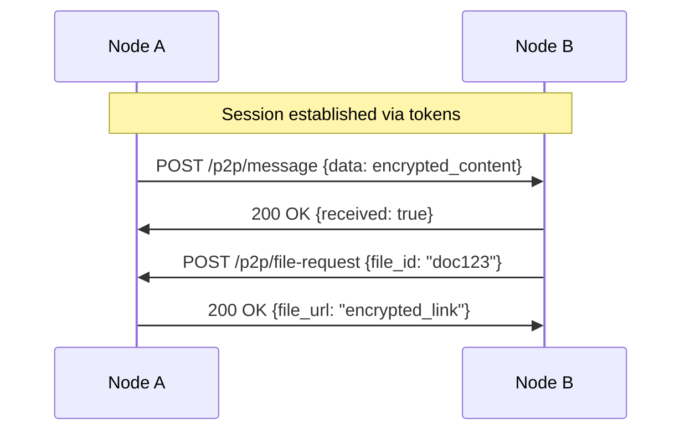

# 🚀 OpenRed v3.0 - Architecture Décentralisée Avancée

🌐 **Navigation Multilingue** | **Multilingual Navigation**
- [🇫🇷 Français](#français) | [🇺🇸 English](#english) | [🇪🇸 Español](#español) | [🇨🇳 中文](#中文)

---

## Français

# 🚀 OpenRed v3.0 - Architecture Décentralisée Avancée

## 📋 Vue d'ensemble

OpenRed v3.0 adopte une architecture **ultra-décentralisée** où l'API centrale sert uniquement d'**annuaire de découverte**, tandis que chaque nœud gère sa propre sécurité, cryptographie et communications directes.

## 🏗️ Architecture Générale

```
┌─────────────────────────────────────────────────────────────────┐
│                    OPENRED CENTRAL API                         │
│                   (Annuaire Minimal)                           │
│  ┌─────────────────────────────────────────────────────────┐   │
│  │ • ID des nœuds                                          │   │
│  │ • URLs des APIs nœuds                                   │   │
│  │ • Service de génération de tokens temporaires          │   │
│  │ • Routage des tokens vers les nœuds                    │   │
│  └─────────────────────────────────────────────────────────┘   │
└─────────────────────────────────────────────────────────────────┘
                                   │
                                   │ Distribution des tokens
                                   │
              ┌────────────────────┼────────────────────┐
              │                    │                    │
              ▼                    ▼                    ▼
    ┌─────────────────┐  ┌─────────────────┐  ┌─────────────────┐
    │   NŒUD A        │  │   NŒUD B        │  │   NŒUD C        │
    │                 │  │                 │  │                 │
    │ ┌─────────────┐ │  │ ┌─────────────┐ │  │ ┌─────────────┐ │
    │ │ Crypto Core │ │  │ │ Crypto Core │ │  │ │ Crypto Core │ │
    │ │   Module    │ │  │ │   Module    │ │  │ │   Module    │ │
    │ └─────────────┘ │  │ └─────────────┘ │  │ └─────────────┘ │
    │ ┌─────────────┐ │  │ ┌─────────────┐ │  │ ┌─────────────┐ │
    │ │   Token     │ │  │ │   Token     │ │  │ │   Token     │ │
    │ │  Manager    │ │  │ │  Manager    │ │  │ │  Manager    │ │
    │ └─────────────┘ │  │ └─────────────┘ │  │ └─────────────┘ │
    │ ┌─────────────┐ │  │ ┌─────────────┐ │  │ ┌─────────────┐ │
    │ │   P2P API   │ │  │ │   P2P API   │ │  │ │   P2P API   │ │
    │ └─────────────┘ │  │ └─────────────┘ │  │ └─────────────┘ │
    └─────────────────┘  └─────────────────┘  └─────────────────┘
              │                    │                    │
              └────────────────────┼────────────────────┘
                                   │
                      Communications P2P directes
```

## 🎯 Composants Principaux

### 1. **OpenRed Central API** (Ultra-minimaliste)

#### 📋 Responsabilités
- **Annuaire** : Stockage ID nœuds ↔ URLs APIs
- **Génération de tokens** : Création de tokens temporaires pour établissement de liaison
- **Distribution** : Envoi automatique des tokens aux nœuds concernés
- **Aucun stockage** : Pas de tokens, pas de données utilisateur

#### 💾 Structure de données
```python
{
    "nodes": {
        "node_a_id": {
            "api_url": "https://node-a.example.com/api",
            "last_seen": "2025-09-22T10:30:00Z",
            "status": "active"
        },
        "node_b_id": {
            "api_url": "https://node-b.example.com/api", 
            "last_seen": "2025-09-22T10:25:00Z",
            "status": "active"
        }
    }
}
```

#### 🔄 API Endpoints
```
POST /api/v3/nodes/register
POST /api/v3/tokens/request-connection
GET  /api/v3/nodes/discover
GET  /api/v3/health
```

### 2. **Nœuds OpenRed** (Autonomes et sécurisés)

#### 🏗️ Structure modulaire
```
openred-node/
├── core/
│   ├── crypto_engine/          # Moteur cryptographique
│   │   ├── methods/
│   │   │   ├── cipher_alpha.py    # Méthode crypto A
│   │   │   ├── cipher_beta.py     # Méthode crypto B
│   │   │   ├── cipher_gamma.py    # Méthode crypto C
│   │   │   └── cipher_factory.py  # Sélecteur de méthode
│   │   ├── token_processor.py     # Processeur de tokens
│   │   └── validator.py          # Validateur de tokens
│   ├── token_manager/          # Gestionnaire de tokens
│   │   ├── storage.py             # Stockage .env
│   │   ├── lifecycle.py           # Cycle de vie tokens
│   │   └── sync.py                # Synchronisation
│   └── p2p_api/               # API P2P
│       ├── routes.py              # Routes API
│       ├── middleware.py          # Middleware sécurité
│       └── handlers.py            # Gestionnaires
├── modules/
│   ├── messaging/             # Module messagerie
│   ├── file_sharing/          # Module partage fichiers
│   ├── authentication/        # Module auth avancée
│   └── monitoring/            # Module monitoring
├── venv/                      # Environnement virtuel principal
├── crypto_venv/               # Env virtuel crypto isolé
├── .env                       # Variables d'environnement
└── main.py                    # Point d'entrée
```

## 🔐 Système Cryptographique Innovant

### 1. **Génération de tokens asymétriques**

#### 🎲 Principe de base
Chaque token est généré avec deux variations cryptographiques différentes mais mathématiquement liées.

#### 🔄 Processus de génération
```python
def generate_asymmetric_tokens(node_a_id, node_b_id, timestamp):
    """
    Génère deux tokens différents mais cryptographiquement liés
    """
    # Base commune secrète
    base_secret = sha256(f"{node_a_id}:{node_b_id}:{timestamp}").digest()
    
    # Token pour nœud A
    token_a = transform_with_node_salt(base_secret, node_a_id, "variant_alpha")
    
    # Token pour nœud B  
    token_b = transform_with_node_salt(base_secret, node_b_id, "variant_beta")
    
    return token_a, token_b
```

#### 🧮 Méthodes de transformation
1. **XOR avec salt unique** : `token ⊕ node_salt`
2. **Rotation circulaire** : Décalage bits basé sur node_id
3. **Permutation contrôlée** : Réarrangement bytes selon algorithme
4. **Hash en cascade** : Multiple hashage avec seeds différents

### 2. **Validation croisée**

#### 🔍 Principe de reconnaissance
```python
def tokens_match(token_a, token_b, node_a_id, node_b_id, timestamp):
    """
    Vérifie si deux tokens différents proviennent de la même source
    """
    # Reconstruction du secret de base depuis token_a
    reconstructed_from_a = reverse_transform(token_a, node_a_id, "variant_alpha")
    
    # Reconstruction du secret de base depuis token_b  
    reconstructed_from_b = reverse_transform(token_b, node_b_id, "variant_beta")
    
    # Comparaison des secrets reconstruits
    return reconstructed_from_a == reconstructed_from_b
```

### 3. **Méthodes cryptographiques par époque**

#### 📅 Sélection temporelle
```python
def select_crypto_method(timestamp):
    """
    Sélectionne la méthode crypto selon la date/heure
    """
    hour = datetime.fromisoformat(timestamp).hour
    day = datetime.fromisoformat(timestamp).day
    
    # Exemple de sélection
    method_index = (hour + day) % NUMBER_OF_METHODS
    
    methods = ["cipher_alpha", "cipher_beta", "cipher_gamma", "cipher_delta"]
    return methods[method_index]
```

#### 🔄 Rotation des méthodes
- **Horaire** : Changement toutes les heures
- **Quotidienne** : Changement par jour de la semaine  
- **Aléatoire contrôlée** : Basée sur timestamp + seed

## 🔄 Flux de Communication

### 1. **Établissement de connexion**

```mermaid
sequenceDiagram
    participant NA as Nœud A
    participant CA as Central API
    participant NB as Nœud B
    
    NA->>CA: POST /tokens/request-connection {target: node_b_id}
    CA->>CA: Génère token_a et token_b
    CA->>NA: POST /tokens/receive {from: node_b_id, token: token_a}
    CA->>NB: POST /tokens/receive {from: node_a_id, token: token_b}
    NA->>NB: POST /p2p/handshake {token: token_a}
    NB->>NB: Valide tokens_match(token_a, token_b)
    NB->>NA: 200 OK {session_established: true}
```



### 2. **Communication P2P directe**

```mermaid
sequenceDiagram
    participant NA as Nœud A
    participant NB as Nœud B
    
    Note over NA,NB: Session établie via tokens
    
    NA->>NB: POST /p2p/message {data: encrypted_content}
    NB->>NA: 200 OK {received: true}
    
    NB->>NA: POST /p2p/file-request {file_id: "doc123"}
    NA->>NB: 200 OK {file_url: "encrypted_link"}
```



## 🛡️ Sécurité Avancée

### 1. **Isolation des environnements**

#### 🔒 Séparation crypto
```bash
# Environnement principal
/openred-node/venv/
├── FastAPI, SQLite, etc.

# Environnement crypto isolé  
/openred-node/crypto_venv/
├── Uniquement modules crypto
├── Pas d'accès réseau
├── Chroot jail possible
```

#### 🚧 Communication inter-env
```python
def crypto_operation(data, method):
    """
    Exécute opération crypto dans environnement isolé
    """
    # Communication via pipes/sockets Unix
    result = subprocess.run([
        "crypto_venv/bin/python", 
        "crypto_engine/processor.py",
        "--method", method,
        "--data", data
    ], capture_output=True, text=True)
    
    return result.stdout
```

### 2. **Gestion des tokens sécurisée**

#### 💾 Stockage .env chiffré
```python
# .env (chiffré au repos)
NODE_A_TOKEN_ABC123=encrypted:AES256:base64data
NODE_B_TOKEN_DEF456=encrypted:AES256:base64data
TOKEN_MASTER_KEY=derived_from_node_secret
```

#### 🔄 Rotation automatique
- **Expiration** : Tokens expirés automatiquement
- **Renouvellement** : Demande automatique avant expiration
- **Nettoyage** : Suppression tokens obsolètes

### 3. **Audit et monitoring**

#### 📊 Logging sécurisé
```python
# Logs chiffrés et signés
{
    "timestamp": "2025-09-22T10:30:00Z",
    "event": "token_validation", 
    "node_id": "hashed_node_id",
    "success": true,
    "signature": "crypto_signature"
}
```

## 📈 Performance et Scalabilité

### 1. **Optimisations**

#### ⚡ Cache intelligent
```python
# Cache tokens validés
token_cache = {
    "node_pair_hash": {
        "valid_until": timestamp,
        "crypto_method": "cipher_alpha",
        "validation_result": True
    }
}
```

#### 🔄 Pool de connexions
```python
# Pool connexions P2P réutilisables
connection_pool = {
    "node_id": persistent_connection,
    "max_connections": 100,
    "timeout": 300
}
```

### 2. **Évolutivité modulaire**

#### 🧩 Architecture plugin
```python
class OpenRedModule:
    def register_routes(self, app):
        pass
    
    def register_crypto_methods(self, crypto_engine):
        pass
        
    def register_middleware(self, app):
        pass

# Modules chargeables à chaud
modules = [
    MessagingModule(),
    FileSharingModule(), 
    AuthenticationModule(),
    CustomModule()
]
```

## 🚀 Modules Extensibles

### 1. **Module Messaging**
```python
# messaging/routes.py
@router.post("/p2p/message/send")
async def send_message(message: EncryptedMessage, token: str):
    # Validation token P2P
    # Chiffrement bout-en-bout
    # Routage direct
    pass
```

### 2. **Module File Sharing**
```python
# file_sharing/routes.py  
@router.post("/p2p/file/share")
async def share_file(file_request: FileShareRequest, token: str):
    # Validation permissions
    # Génération liens temporaires
    # Chiffrement fichiers
    pass
```

### 3. **Module Authentication**
```python
# authentication/routes.py
@router.post("/p2p/auth/challenge")
async def auth_challenge(challenge: AuthChallenge, token: str):
    # Multi-factor authentication
    # Biométrie optionnelle
    # Sessions sécurisées
    pass
```

## 📋 Avantages de cette Architecture

### ✅ **Sécurité**
- **Zero-trust** : Chaque nœud vérifie indépendamment
- **Crypto distribué** : Pas de point de défaillance unique
- **Isolation** : Modules crypto séparés
- **Tokens asymétriques** : Impossible à intercepter et réutiliser

### ✅ **Performance**  
- **P2P direct** : Pas de goulot d'étranglement central
- **Cache intelligent** : Validation rapide
- **Modules à la demande** : Charge uniquement le nécessaire

### ✅ **Scalabilité**
- **Décentralisé** : Croissance horizontale naturelle
- **Modulaire** : Ajout de fonctionnalités sans refactoring
- **Indépendant** : Chaque nœud autonome

### ✅ **Maintenance**
- **API centrale minimaliste** : Moins de bugs
- **Nœuds autonomes** : Mise à jour indépendante
- **Standards ouverts** : Interopérabilité

## 🎯 Prochaines Étapes

1. **Implémentation crypto core** : Système de tokens asymétriques
2. **API centrale v3** : Version ultra-minimaliste  
3. **Nœud prototype** : Premier nœud fonctionnel
4. **Modules de base** : Messaging + Authentication
5. **Tests P2P** : Validation communications directes
6. **Documentation** : Guide développeur modules

---

Cette architecture offre un équilibre optimal entre **sécurité**, **performance** et **simplicité**, tout en permettant une **évolutivité maximale** pour l'écosystème OpenRed.

---

## English

# 🚀 OpenRed v3.0 - Advanced Decentralized Architecture

## 📋 Overview

OpenRed v3.0 adopts an **ultra-decentralized** architecture where the central API serves only as a **discovery directory**, while each node manages its own security, cryptography, and direct communications.

## 🏗️ General Architecture

```
┌─────────────────────────────────────────────────────────────────┐
│                    OPENRED CENTRAL API                         │
│                   (Minimal Directory)                          │
│  ┌─────────────────────────────────────────────────────────┐   │
│  │ • Node IDs                                              │   │
│  │ • Node API URLs                                         │   │
│  │ • Temporary token generation service                    │   │
│  │ • Token routing to nodes                                │   │
│  └─────────────────────────────────────────────────────────┘   │
└─────────────────────────────────────────────────────────────────┘
                                   │
                                   │ Token distribution
                                   │
              ┌────────────────────┼────────────────────┐
              │                    │                    │
              ▼                    ▼                    ▼
    ┌─────────────────┐  ┌─────────────────┐  ┌─────────────────┐
    │   NODE A        │  │   NODE B        │  │   NODE C        │
    │                 │  │                 │  │                 │
    │ ┌─────────────┐ │  │ ┌─────────────┐ │  │ ┌─────────────┐ │
    │ │ Crypto Core │ │  │ │ Crypto Core │ │  │ │ Crypto Core │ │
    │ │   Module    │ │  │ │   Module    │ │  │ │   Module    │ │
    │ └─────────────┘ │  │ └─────────────┘ │  │ └─────────────┘ │
    │ ┌─────────────┐ │  │ ┌─────────────┐ │  │ ┌─────────────┐ │
    │ │   Token     │ │  │ │   Token     │ │  │ │   Token     │ │
    │ │  Manager    │ │  │ │  Manager    │ │  │ │  Manager    │ │
    │ └─────────────┘ │  │ └─────────────┘ │  │ └─────────────┘ │
    │ ┌─────────────┐ │  │ ┌─────────────┐ │  │ ┌─────────────┐ │
    │ │   P2P API   │ │  │ │   P2P API   │ │  │ │   P2P API   │ │
    │ └─────────────┘ │  │ └─────────────┘ │  │ └─────────────┘ │
    └─────────────────┘  └─────────────────┘  └─────────────────┘
              │                    │                    │
              └────────────────────┼────────────────────┘
                                   │
                      Direct P2P communications
```

## 🎯 Main Components

### 1. **OpenRed Central API** (Ultra-minimalist)

#### 📋 Responsibilities
- **Directory**: Node ID ↔ API URL storage
- **Token generation**: Temporary tokens for connection establishment
- **Distribution**: Automatic token sending to concerned nodes
- **No storage**: No tokens, no user data

#### 💾 Data structure
```python
{
    "nodes": {
        "node_a_id": {
            "api_url": "https://node-a.example.com/api",
            "last_seen": "2025-09-22T10:30:00Z",
            "status": "active"
        },
        "node_b_id": {
            "api_url": "https://node-b.example.com/api", 
            "last_seen": "2025-09-22T10:25:00Z",
            "status": "active"
        }
    }
}
```

### 2. **OpenRed Nodes** (Autonomous and secure)

#### 🏗️ Modular structure
```
openred-node/
├── core/
│   ├── crypto_engine/          # Cryptographic engine
│   │   ├── methods/
│   │   │   ├── cipher_alpha.py    # Crypto method A
│   │   │   ├── cipher_beta.py     # Crypto method B
│   │   │   ├── cipher_gamma.py    # Crypto method C
│   │   │   └── cipher_factory.py  # Method selector
│   │   ├── token_processor.py     # Token processor
│   │   └── validator.py          # Token validator
│   ├── token_manager/          # Token manager
│   │   ├── storage.py             # .env storage
│   │   ├── lifecycle.py           # Token lifecycle
│   │   └── sync.py                # Synchronization
│   └── p2p_api/               # P2P API
│       ├── routes.py              # API routes
│       ├── middleware.py          # Security middleware
│       └── handlers.py            # Handlers
├── modules/
│   ├── messaging/             # Messaging module
│   ├── file_sharing/          # File sharing module
│   ├── authentication/        # Advanced auth module
│   └── monitoring/            # Monitoring module
├── venv/                      # Main virtual environment
├── crypto_venv/               # Isolated crypto env
├── .env                       # Environment variables
└── main.py                    # Entry point
```

## 🔐 Innovative Cryptographic System

### 1. **Asymmetric token generation**

#### 🎲 Basic principle
Each token is generated with two different but mathematically linked cryptographic variations.

### 2. **Cross validation**

#### 🔍 Recognition principle
```python
def tokens_match(token_a, token_b, node_a_id, node_b_id, timestamp):
    """
    Verifies if two different tokens come from the same source
    """
    # Reconstruct base secret from token_a
    reconstructed_from_a = reverse_transform(token_a, node_a_id, "variant_alpha")
    
    # Reconstruct base secret from token_b  
    reconstructed_from_b = reverse_transform(token_b, node_b_id, "variant_beta")
    
    # Compare reconstructed secrets
    return reconstructed_from_a == reconstructed_from_b
```

#### 🔄 Generation process
```python
def generate_asymmetric_tokens(node_a_id, node_b_id, timestamp):
    """
    Generates two different but cryptographically linked tokens
    """
    # Common secret base
    base_secret = sha256(f"{node_a_id}:{node_b_id}:{timestamp}").digest()
    
    # Token for node A
    token_a = transform_with_node_salt(base_secret, node_a_id, "variant_alpha")
    
    # Token for node B  
    token_b = transform_with_node_salt(base_secret, node_b_id, "variant_beta")
    
    return token_a, token_b
```

#### 🧮 Transformation methods
1. **XOR with unique salt**: `token ⊕ node_salt`
2. **Circular rotation**: Bit shifting based on node_id
3. **Controlled permutation**: Byte rearrangement according to algorithm
4. **Cascade hashing**: Multiple hashing with different seeds

### 3. **Cryptographic methods by epoch**

#### 📅 Temporal selection
```python
def select_crypto_method(timestamp):
    """
    Selects crypto method according to date/time
    """
    hour = datetime.fromisoformat(timestamp).hour
    day = datetime.fromisoformat(timestamp).day
    
    # Selection example
    method_index = (hour + day) % NUMBER_OF_METHODS
    
    methods = ["cipher_alpha", "cipher_beta", "cipher_gamma", "cipher_delta"]
    return methods[method_index]
```

#### 🔄 Method rotation
- **Hourly**: Change every hour
- **Daily**: Change by day of the week  
- **Controlled random**: Based on timestamp + seed

## 🔄 Communication Flow

### 1. **Connection establishment**


### 2. **Direct P2P communication**



## 🛡️ Advanced Security

### 1. **Environment isolation**

#### 🔒 Crypto separation
```bash
# Main environment
/openred-node/venv/
├── FastAPI, SQLite, etc.

# Isolated crypto environment  
/openred-node/crypto_venv/
├── Only crypto modules
├── No network access
├── Possible Chroot jail
```

#### 🚧 Inter-env communication
```python
def crypto_operation(data, method):
    """
    Execute crypto operation in isolated environment
    """
    # Communication via pipes/Unix sockets
    result = subprocess.run([
        "crypto_venv/bin/python", 
        "crypto_engine/processor.py",
        "--method", method,
        "--data", data
    ], capture_output=True, text=True)
    
    return result.stdout
```

### 2. **Secure token management**

#### 💾 Encrypted .env storage
```python
# .env (encrypted at rest)
NODE_A_TOKEN_ABC123=encrypted:AES256:base64data
NODE_B_TOKEN_DEF456=encrypted:AES256:base64data
TOKEN_MASTER_KEY=derived_from_node_secret
```

#### 🔄 Automatic rotation
- **Expiration**: Tokens automatically expired
- **Renewal**: Automatic request before expiration
- **Cleanup**: Removal of obsolete tokens

### 3. **Audit and monitoring**

#### 📊 Secure logging
```python
# Encrypted and signed logs
{
    "timestamp": "2025-09-22T10:30:00Z",
    "event": "token_validation", 
    "node_id": "hashed_node_id",
    "success": true,
    "signature": "crypto_signature"
}
```

## 📈 Performance and Scalability

### 1. **Optimizations**

#### ⚡ Intelligent caching
```python
# Cache validated tokens
token_cache = {
    "node_pair_hash": {
        "valid_until": timestamp,
        "crypto_method": "cipher_alpha",
        "validation_result": True
    }
}
```

#### 🔄 Connection pools
```python
# Reusable P2P connection pool
connection_pool = {
    "node_id": persistent_connection,
    "max_connections": 100,
    "timeout": 300
}
```

### 2. **Modular scalability**

#### 🧩 Plugin architecture
```python
class OpenRedModule:
    def register_routes(self, app):
        pass
    
    def register_crypto_methods(self, crypto_engine):
        pass
        
    def register_middleware(self, app):
        pass

# Hot-loadable modules
modules = [
    MessagingModule(),
    FileSharingModule(), 
    AuthenticationModule(),
    CustomModule()
]
```

## 🚀 Extensible Modules

### 1. **Messaging Module**
```python
# messaging/routes.py
@router.post("/p2p/message/send")
async def send_message(message: EncryptedMessage, token: str):
    # P2P token validation
    # End-to-end encryption
    # Direct routing
    pass
```

### 2. **File Sharing Module**
```python
# file_sharing/routes.py  
@router.post("/p2p/file/share")
async def share_file(file_request: FileShareRequest, token: str):
    # Permission validation
    # Generate temporary links
    # File encryption
    pass
```

### 3. **Authentication Module**
```python
# authentication/routes.py
@router.post("/p2p/auth/challenge")
async def auth_challenge(challenge: AuthChallenge, token: str):
    # Multi-factor authentication
    # Optional biometrics
    # Secure sessions
    pass
```

## 🔄 Communication Flow

### 1. **Connection establishment**

1. Node A requests connection to Node B via Central API
2. Central API generates asymmetric tokens (token_a, token_b)
3. Central API distributes tokens to both nodes
4. Nodes establish direct P2P connection using tokens
5. Cross-validation ensures security

### 2. **Direct P2P communication**

Once connection established, nodes communicate directly without central intervention.

## 🛡️ Advanced Security

### 1. **Environment isolation**

#### 🔒 Crypto separation
- Main environment: FastAPI, SQLite, etc.
- Crypto environment: Only crypto modules, no network access

### 2. **Secure token management**

#### 💾 Encrypted .env storage
- Tokens encrypted at rest
- Automatic rotation
- Obsolete token cleanup

## 📈 Performance and Scalability

### 1. **Optimizations**

- Intelligent caching
- Connection pools
- Hot-loadable modules

### 2. **Modular evolution**

- Plugin architecture
- Independent module updates
- Open standards for interoperability

## 📋 Architecture Advantages

### ✅ **Security**
- Zero-trust: Each node verifies independently
- Distributed crypto: No single point of failure
- Isolation: Separated crypto modules
- Asymmetric tokens: Impossible to intercept and reuse

### ✅ **Performance**  
- Direct P2P: No central bottleneck
- Intelligent cache: Fast validation
- On-demand modules: Load only what's needed

### ✅ **Scalability**
- Decentralized: Natural horizontal growth
- Modular: Add features without refactoring
- Independent: Each node autonomous

This architecture offers an optimal balance between **security**, **performance**, and **simplicity**, while enabling **maximum scalability** for the OpenRed ecosystem.

---

## Español

# 🚀 OpenRed v3.0 - Arquitectura Descentralizada Avanzada

## 📋 Visión General

OpenRed v3.0 adopta una arquitectura **ultra-descentralizada** donde la API central sirve únicamente como **directorio de descubrimiento**, mientras cada nodo gestiona su propia seguridad, criptografía y comunicaciones directas.

## �️ Arquitectura General

```
┌─────────────────────────────────────────────────────────────────┐
│                    API CENTRAL OPENRED                         │
│                   (Directorio Mínimo)                          │
│  ┌─────────────────────────────────────────────────────────┐   │
│  │ • IDs de nodos                                          │   │
│  │ • URLs de APIs de nodos                                 │   │
│  │ • Servicio de generación de tokens temporales          │   │
│  │ • Enrutamiento de tokens hacia nodos                   │   │
│  └─────────────────────────────────────────────────────────┘   │
└─────────────────────────────────────────────────────────────────┘
                                   │
                                   │ Distribución de tokens
                                   │
              ┌────────────────────┼────────────────────┐
              │                    │                    │
              ▼                    ▼                    ▼
    ┌─────────────────┐  ┌─────────────────┐  ┌─────────────────┐
    │   NODO A        │  │   NODO B        │  │   NODO C        │
    │                 │  │                 │  │                 │
    │ ┌─────────────┐ │  │ ┌─────────────┐ │  │ ┌─────────────┐ │
    │ │ Núcleo      │ │  │ │ Núcleo      │ │  │ │ Núcleo      │ │
    │ │ Cripto      │ │  │ │ Cripto      │ │  │ │ Cripto      │ │
    │ └─────────────┘ │  │ └─────────────┘ │  │ └─────────────┘ │
    │ ┌─────────────┐ │  │ ┌─────────────┐ │  │ ┌─────────────┐ │
    │ │ Gestor de   │ │  │ │ Gestor de   │ │  │ │ Gestor de   │ │
    │ │ Tokens      │ │  │ │ Tokens      │ │  │ │ Tokens      │ │
    │ └─────────────┘ │  │ └─────────────┘ │  │ └─────────────┘ │
    │ ┌─────────────┐ │  │ ┌─────────────┐ │  │ ┌─────────────┐ │
    │ │   API P2P   │ │  │ │   API P2P   │ │  │ │   API P2P   │ │
    │ └─────────────┘ │  │ └─────────────┘ │  │ └─────────────┘ │
    └─────────────────┘  └─────────────────┘  └─────────────────┘
              │                    │                    │
              └────────────────────┼────────────────────┘
                                   │
                      Comunicaciones P2P directas
```

## �🎯 Componentes Principales

### 1. **API Central OpenRed** (Ultra-minimalista)

#### 📋 Responsabilidades
- **Directorio**: Almacenamiento ID nodos ↔ URLs APIs
- **Generación de tokens**: Creación de tokens temporales para establecimiento de enlace
- **Distribución**: Envío automático de tokens a nodos concernidos
- **Sin almacenamiento**: Sin tokens, sin datos de usuario

#### 💾 Estructura de datos
```python
{
    "nodes": {
        "node_a_id": {
            "api_url": "https://node-a.example.com/api",
            "last_seen": "2025-09-22T10:30:00Z",
            "status": "active"
        },
        "node_b_id": {
            "api_url": "https://node-b.example.com/api", 
            "last_seen": "2025-09-22T10:25:00Z",
            "status": "active"
        }
    }
}
```

#### 🔄 Endpoints API
```
POST /api/v3/nodes/register
POST /api/v3/tokens/request-connection
GET  /api/v3/nodes/discover
GET  /api/v3/health
```

### 2. **Nodos OpenRed** (Autónomos y seguros)

#### 🏗️ Estructura modular
```
openred-node/
├── core/
│   ├── crypto_engine/          # Motor criptográfico
│   │   ├── methods/
│   │   │   ├── cipher_alpha.py    # Método cripto A
│   │   │   ├── cipher_beta.py     # Método cripto B
│   │   │   ├── cipher_gamma.py    # Método cripto C
│   │   │   └── cipher_factory.py  # Selector de método
│   │   ├── token_processor.py     # Procesador de tokens
│   │   └── validator.py          # Validador de tokens
│   ├── token_manager/          # Gestor de tokens
│   │   ├── storage.py             # Almacenamiento .env
│   │   ├── lifecycle.py           # Ciclo de vida tokens
│   │   └── sync.py                # Sincronización
│   └── p2p_api/               # API P2P
│       ├── routes.py              # Rutas API
│       ├── middleware.py          # Middleware seguridad
│       └── handlers.py            # Manejadores
├── modules/
│   ├── messaging/             # Módulo mensajería
│   ├── file_sharing/          # Módulo compartir archivos
│   ├── authentication/        # Módulo auth avanzada
│   └── monitoring/            # Módulo monitoreo
├── venv/                      # Entorno virtual principal
├── crypto_venv/               # Env virtual cripto aislado
├── .env                       # Variables de entorno
└── main.py                    # Punto de entrada
```

## 🔐 Sistema Criptográfico Innovador

### 1. **Generación de tokens asimétricos**

#### 🎲 Principio básico
Cada token se genera con dos variaciones criptográficas diferentes pero matemáticamente vinculadas.

#### 🔄 Proceso de generación
```python
def generate_asymmetric_tokens(node_a_id, node_b_id, timestamp):
    """
    Genera dos tokens diferentes pero criptográficamente vinculados
    """
    # Base común secreta
    base_secret = sha256(f"{node_a_id}:{node_b_id}:{timestamp}").digest()
    
    # Token para nodo A
    token_a = transform_with_node_salt(base_secret, node_a_id, "variant_alpha")
    
    # Token para nodo B  
    token_b = transform_with_node_salt(base_secret, node_b_id, "variant_beta")
    
    return token_a, token_b
```

#### 🧮 Métodos de transformación
1. **XOR con salt único**: `token ⊕ node_salt`
2. **Rotación circular**: Desplazamiento bits basado en node_id
3. **Permutación controlada**: Reordenamiento bytes según algoritmo
4. **Hash en cascada**: Múltiple hasheo con seeds diferentes

### 2. **Validación cruzada**

#### 🔍 Principio de reconocimiento
```python
def tokens_match(token_a, token_b, node_a_id, node_b_id, timestamp):
    """
    Verifica si dos tokens diferentes provienen de la misma fuente
    """
    # Reconstrucción del secreto base desde token_a
    reconstructed_from_a = reverse_transform(token_a, node_a_id, "variant_alpha")
    
    # Reconstrucción del secreto base desde token_b  
    reconstructed_from_b = reverse_transform(token_b, node_b_id, "variant_beta")
    
    # Comparación de secretos reconstruidos
    return reconstructed_from_a == reconstructed_from_b
```

### 3. **Métodos criptográficos por época**

#### 📅 Selección temporal
```python
def select_crypto_method(timestamp):
    """
    Selecciona el método cripto según fecha/hora
    """
    hour = datetime.fromisoformat(timestamp).hour
    day = datetime.fromisoformat(timestamp).day
    
    # Ejemplo de selección
    method_index = (hour + day) % NUMBER_OF_METHODS
    
    methods = ["cipher_alpha", "cipher_beta", "cipher_gamma", "cipher_delta"]
    return methods[method_index]
```

#### 🔄 Rotación de métodos
- **Por hora**: Cambio cada hora
- **Diaria**: Cambio por día de la semana  
- **Aleatoria controlada**: Basada en timestamp + seed

## 🔄 Flujo de Comunicación

### 1. **Establecimiento de conexión**


### 2. **Comunicación P2P directa**

```mermaid
sequenceDiagram
    participant NA as Nodo A
    participant NB as Nodo B
    
    Note over NA,NB: Sesión establecida vía tokens
    
    NA->>NB: POST /p2p/message {data: encrypted_content}
    NB->>NA: 200 OK {received: true}
    
    NB->>NA: POST /p2p/file-request {file_id: "doc123"}
    NA->>NB: 200 OK {file_url: "encrypted_link"}
```



## 🛡️ Seguridad Avanzada

### 1. **Aislamiento de entornos**

#### 🔒 Separación cripto
```bash
# Entorno principal
/openred-node/venv/
├── FastAPI, SQLite, etc.

# Entorno cripto aislado  
/openred-node/crypto_venv/
├── Solo módulos cripto
├── Sin acceso red
├── Chroot jail posible
```

#### 🚧 Comunicación inter-env
```python
def crypto_operation(data, method):
    """
    Ejecuta operación cripto en entorno aislado
    """
    # Comunicación vía pipes/sockets Unix
    result = subprocess.run([
        "crypto_venv/bin/python", 
        "crypto_engine/processor.py",
        "--method", method,
        "--data", data
    ], capture_output=True, text=True)
    
    return result.stdout
```

### 2. **Gestión de tokens segura**

#### 💾 Almacenamiento .env cifrado
```python
# .env (cifrado en reposo)
NODE_A_TOKEN_ABC123=encrypted:AES256:base64data
NODE_B_TOKEN_DEF456=encrypted:AES256:base64data
TOKEN_MASTER_KEY=derived_from_node_secret
```

#### 🔄 Rotación automática
- **Expiración**: Tokens expirados automáticamente
- **Renovación**: Solicitud automática antes de expiración
- **Limpieza**: Eliminación tokens obsoletos

### 3. **Auditoría y monitoreo**

#### � Logging seguro
```python
# Logs cifrados y firmados
{
    "timestamp": "2025-09-22T10:30:00Z",
    "event": "token_validation", 
    "node_id": "hashed_node_id",
    "success": true,
    "signature": "crypto_signature"
}
```

## �📈 Rendimiento y Escalabilidad

### 1. **Optimizaciones**

#### ⚡ Caché inteligente
```python
# Caché tokens validados
token_cache = {
    "node_pair_hash": {
        "valid_until": timestamp,
        "crypto_method": "cipher_alpha",
        "validation_result": True
    }
}
```

#### 🔄 Pool de conexiones
```python
# Pool conexiones P2P reutilizables
connection_pool = {
    "node_id": persistent_connection,
    "max_connections": 100,
    "timeout": 300
}
```

### 2. **Escalabilidad modular**

#### 🧩 Arquitectura plugin
```python
class OpenRedModule:
    def register_routes(self, app):
        pass
    
    def register_crypto_methods(self, crypto_engine):
        pass
        
    def register_middleware(self, app):
        pass

# Módulos cargables en caliente
modules = [
    MessagingModule(),
    FileSharingModule(), 
    AuthenticationModule(),
    CustomModule()
]
```

## 🚀 Módulos Extensibles

### 1. **Módulo Mensajería**
```python
# messaging/routes.py
@router.post("/p2p/message/send")
async def send_message(message: EncryptedMessage, token: str):
    # Validación token P2P
    # Cifrado extremo-a-extremo
    # Enrutamiento directo
    pass
```

### 2. **Módulo Compartir Archivos**
```python
# file_sharing/routes.py  
@router.post("/p2p/file/share")
async def share_file(file_request: FileShareRequest, token: str):
    # Validación permisos
    # Generación enlaces temporales
    # Cifrado archivos
    pass
```

### 3. **Módulo Autenticación**
```python
# authentication/routes.py
@router.post("/p2p/auth/challenge")
async def auth_challenge(challenge: AuthChallenge, token: str):
    # Autenticación multi-factor
    # Biometría opcional
    # Sesiones seguras
    pass
```

## 📋 Ventajas de esta Arquitectura

### ✅ **Seguridad**
- **Zero-trust**: Cada nodo verifica independientemente
- **Cripto distribuido**: Sin punto único de falla
- **Aislamiento**: Módulos cripto separados
- **Tokens asimétricos**: Imposible interceptar y reutilizar

### ✅ **Rendimiento**  
- **P2P directo**: Sin cuello de botella central
- **Caché inteligente**: Validación rápida
- **Módulos bajo demanda**: Carga solo lo necesario

### ✅ **Escalabilidad**
- **Descentralizado**: Crecimiento horizontal natural
- **Modular**: Agregar funciones sin refactoring
- **Independiente**: Cada nodo autónomo

### ✅ **Mantenimiento**
- **API central minimalista**: Menos bugs
- **Nodos autónomos**: Actualización independiente
- **Estándares abiertos**: Interoperabilidad

---

## 中文

# 🚀 OpenRed v3.0 - 高级去中心化架构

## 📋 概述

OpenRed v3.0 采用**超去中心化**架构，中央API仅作为**发现目录**，每个节点管理自己的安全、加密和直接通信。

## �️ 总体架构

```
┌─────────────────────────────────────────────────────────────────┐
│                    OPENRED 中央API                             │
│                   (最小目录)                                   │
│  ┌─────────────────────────────────────────────────────────┐   │
│  │ • 节点ID                                                │   │
│  │ • 节点API URL                                           │   │
│  │ • 临时令牌生成服务                                       │   │
│  │ • 令牌路由到节点                                         │   │
│  └─────────────────────────────────────────────────────────┘   │
└─────────────────────────────────────────────────────────────────┘
                                   │
                                   │ 令牌分发
                                   │
              ┌────────────────────┼────────────────────┐
              │                    │                    │
              ▼                    ▼                    ▼
    ┌─────────────────┐  ┌─────────────────┐  ┌─────────────────┐
    │   节点A         │  │   节点B         │  │   节点C         │
    │                 │  │                 │  │                 │
    │ ┌─────────────┐ │  │ ┌─────────────┐ │  │ ┌─────────────┐ │
    │ │ 加密核心    │ │  │ │ 加密核心    │ │  │ │ 加密核心    │ │
    │ │ 模块        │ │  │ │ 模块        │ │  │ │ 模块        │ │
    │ └─────────────┘ │  │ └─────────────┘ │  │ └─────────────┘ │
    │ ┌─────────────┐ │  │ ┌─────────────┐ │  │ ┌─────────────┐ │
    │ │ 令牌        │ │  │ │ 令牌        │ │  │ │ 令牌        │ │
    │ │ 管理器      │ │  │ │ 管理器      │ │  │ │ 管理器      │ │
    │ └─────────────┘ │  │ └─────────────┘ │  │ └─────────────┘ │
    │ ┌─────────────┐ │  │ ┌─────────────┐ │  │ ┌─────────────┐ │
    │ │   P2P API   │ │  │ │   P2P API   │ │  │ │   P2P API   │ │
    │ └─────────────┘ │  │ └─────────────┘ │  │ └─────────────┘ │
    └─────────────────┘  └─────────────────┘  └─────────────────┘
              │                    │                    │
              └────────────────────┼────────────────────┘
                                   │
                      直接P2P通信
```

## �🎯 主要组件

### 1. **OpenRed 中央API**（超极简主义）

#### 📋 职责
- **目录**：节点ID ↔ API URL存储
- **令牌生成**：连接建立的临时令牌创建
- **分发**：自动向相关节点发送令牌
- **无存储**：无令牌，无用户数据

#### 💾 数据结构
```python
{
    "nodes": {
        "node_a_id": {
            "api_url": "https://node-a.example.com/api",
            "last_seen": "2025-09-22T10:30:00Z",
            "status": "active"
        },
        "node_b_id": {
            "api_url": "https://node-b.example.com/api", 
            "last_seen": "2025-09-22T10:25:00Z",
            "status": "active"
        }
    }
}
```

#### 🔄 API端点
```
POST /api/v3/nodes/register
POST /api/v3/tokens/request-connection
GET  /api/v3/nodes/discover
GET  /api/v3/health
```

### 2. **OpenRed 节点**（自主且安全）

#### 🏗️ 模块化结构
```
openred-node/
├── core/
│   ├── crypto_engine/          # 加密引擎
│   │   ├── methods/
│   │   │   ├── cipher_alpha.py    # 加密方法A
│   │   │   ├── cipher_beta.py     # 加密方法B
│   │   │   ├── cipher_gamma.py    # 加密方法C
│   │   │   └── cipher_factory.py  # 方法选择器
│   │   ├── token_processor.py     # 令牌处理器
│   │   └── validator.py          # 令牌验证器
│   ├── token_manager/          # 令牌管理器
│   │   ├── storage.py             # .env存储
│   │   ├── lifecycle.py           # 令牌生命周期
│   │   └── sync.py                # 同步
│   └── p2p_api/               # P2P API
│       ├── routes.py              # API路由
│       ├── middleware.py          # 安全中间件
│       └── handlers.py            # 处理器
├── modules/
│   ├── messaging/             # 消息模块
│   ├── file_sharing/          # 文件共享模块
│   ├── authentication/        # 高级认证模块
│   └── monitoring/            # 监控模块
├── venv/                      # 主虚拟环境
├── crypto_venv/               # 隔离加密环境
├── .env                       # 环境变量
└── main.py                    # 入口点
```

## 🔐 创新加密系统

### 1. **非对称令牌生成**

#### 🎲 基本原理
每个令牌都用两个不同但数学相关的加密变体生成。

#### 🔄 生成过程
```python
def generate_asymmetric_tokens(node_a_id, node_b_id, timestamp):
    """
    生成两个不同但加密相关的令牌
    """
    # 共同秘密基础
    base_secret = sha256(f"{node_a_id}:{node_b_id}:{timestamp}").digest()
    
    # 节点A的令牌
    token_a = transform_with_node_salt(base_secret, node_a_id, "variant_alpha")
    
    # 节点B的令牌  
    token_b = transform_with_node_salt(base_secret, node_b_id, "variant_beta")
    
    return token_a, token_b
```

#### 🧮 变换方法
1. **XOR与唯一salt**：`token ⊕ node_salt`
2. **循环旋转**：基于node_id的位移
3. **受控排列**：根据算法重排字节
4. **级联哈希**：多次哈希与不同种子

### 2. **交叉验证**

#### 🔍 识别原理
```python
def tokens_match(token_a, token_b, node_a_id, node_b_id, timestamp):
    """
    验证两个不同令牌是否来自同一源
    """
    # 从token_a重构基础秘密
    reconstructed_from_a = reverse_transform(token_a, node_a_id, "variant_alpha")
    
    # 从token_b重构基础秘密
    reconstructed_from_b = reverse_transform(token_b, node_b_id, "variant_beta")
    
    # 比较重构的秘密
    return reconstructed_from_a == reconstructed_from_b
```

### 3. **时代加密方法**

#### � 时间选择
```python
def select_crypto_method(timestamp):
    """
    根据日期/时间选择加密方法
    """
    hour = datetime.fromisoformat(timestamp).hour
    day = datetime.fromisoformat(timestamp).day
    
    # 选择示例
    method_index = (hour + day) % NUMBER_OF_METHODS
    
    methods = ["cipher_alpha", "cipher_beta", "cipher_gamma", "cipher_delta"]
    return methods[method_index]
```

#### �🔄 方法轮换
- **每小时**：每小时更换
- **每日**：按星期几更换
- **受控随机**：基于timestamp + seed

## 🔄 通信流程

### 1. **连接建立**


### 2. **直接P2P通信**

```mermaid
sequenceDiagram
    participant NA as 节点A
    participant NB as 节点B
    
    Note over NA,NB: 通过令牌建立会话
    
    NA->>NB: POST /p2p/message {data: encrypted_content}
    NB->>NA: 200 OK {received: true}
    
    NB->>NA: POST /p2p/file-request {file_id: "doc123"}
    NA->>NB: 200 OK {file_url: "encrypted_link"}
```



## 🛡️ 高级安全

### 1. **环境隔离**

#### 🔒 加密分离
```bash
# 主环境
/openred-node/venv/
├── FastAPI, SQLite等

# 隔离加密环境
/openred-node/crypto_venv/
├── 仅加密模块
├── 无网络访问
├── 可能的Chroot jail
```

#### 🚧 环境间通信
```python
def crypto_operation(data, method):
    """
    在隔离环境中执行加密操作
    """
    # 通过pipes/Unix套接字通信
    result = subprocess.run([
        "crypto_venv/bin/python", 
        "crypto_engine/processor.py",
        "--method", method,
        "--data", data
    ], capture_output=True, text=True)
    
    return result.stdout
```

### 2. **安全令牌管理**

#### 💾 加密.env存储
```python
# .env（静态加密）
NODE_A_TOKEN_ABC123=encrypted:AES256:base64data
NODE_B_TOKEN_DEF456=encrypted:AES256:base64data
TOKEN_MASTER_KEY=derived_from_node_secret
```

#### 🔄 自动轮换
- **过期**：令牌自动过期
- **续期**：过期前自动请求
- **清理**：删除过时令牌

### 3. **审计和监控**

#### 📊 安全日志
```python
# 加密和签名的日志
{
    "timestamp": "2025-09-22T10:30:00Z",
    "event": "token_validation", 
    "node_id": "hashed_node_id",
    "success": true,
    "signature": "crypto_signature"
}
```

## 📈 性能和可扩展性

### 1. **优化**

#### ⚡ 智能缓存
```python
# 缓存验证的令牌
token_cache = {
    "node_pair_hash": {
        "valid_until": timestamp,
        "crypto_method": "cipher_alpha",
        "validation_result": True
    }
}
```

#### 🔄 连接池
```python
# 可重用P2P连接池
connection_pool = {
    "node_id": persistent_connection,
    "max_connections": 100,
    "timeout": 300
}
```

### 2. **模块化演进**

#### 🧩 插件架构
```python
class OpenRedModule:
    def register_routes(self, app):
        pass
    
    def register_crypto_methods(self, crypto_engine):
        pass
        
    def register_middleware(self, app):
        pass

# 热加载模块
modules = [
    MessagingModule(),
    FileSharingModule(), 
    AuthenticationModule(),
    CustomModule()
]
```

## 🚀 可扩展模块

### 1. **消息模块**
```python
# messaging/routes.py
@router.post("/p2p/message/send")
async def send_message(message: EncryptedMessage, token: str):
    # P2P令牌验证
    # 端到端加密
    # 直接路由
    pass
```

### 2. **文件共享模块**
```python
# file_sharing/routes.py  
@router.post("/p2p/file/share")
async def share_file(file_request: FileShareRequest, token: str):
    # 权限验证
    # 生成临时链接
    # 文件加密
    pass
```

### 3. **认证模块**
```python
# authentication/routes.py
@router.post("/p2p/auth/challenge")
async def auth_challenge(challenge: AuthChallenge, token: str):
    # 多因素认证
    # 可选生物识别
    # 安全会话
    pass
```

## 📋 架构优势

### ✅ **安全性**
- **零信任**：每个节点独立验证
- **分布式加密**：无单点故障
- **隔离**：分离的加密模块
- **非对称令牌**：无法拦截和重用

### ✅ **性能**  
- **直接P2P**：无中央瓶颈
- **智能缓存**：快速验证
- **按需模块**：只加载所需

### ✅ **可扩展性**
- **去中心化**：自然水平增长
- **模块化**：不重构添加功能
- **独立**：每个节点自治

### ✅ **维护性**
- **极简中央API**：更少bug
- **自治节点**：独立更新
- **开放标准**：互操作性

该架构在**安全性**、**性能**和**简单性**之间提供最佳平衡，同时为OpenRed生态系统实现**最大可扩展性**。

---

🌐 **Navigation** | **导航**
- [🇫🇷 Français](#français) | [🇺🇸 English](#english) | [🇪🇸 Español](#español) | [🇨🇳 中文](#中文)
