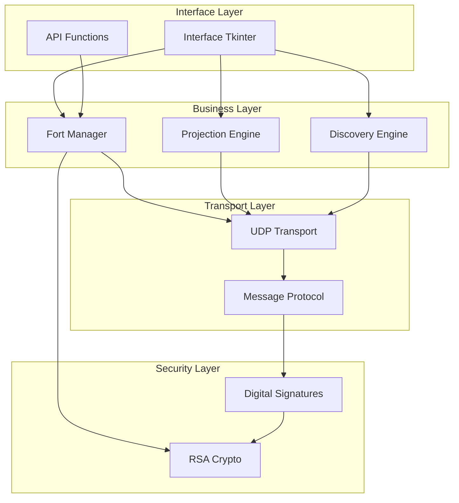
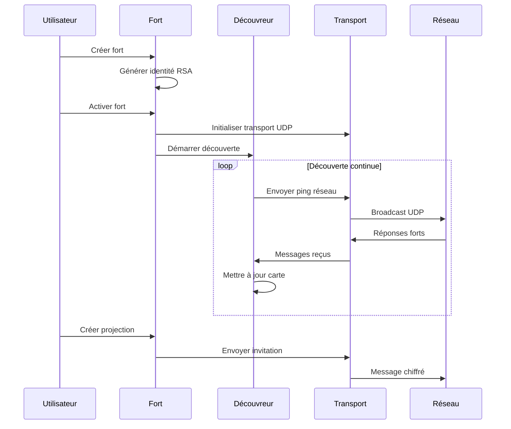
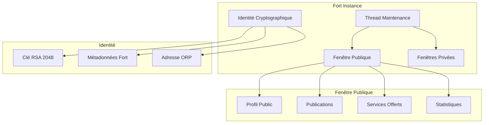
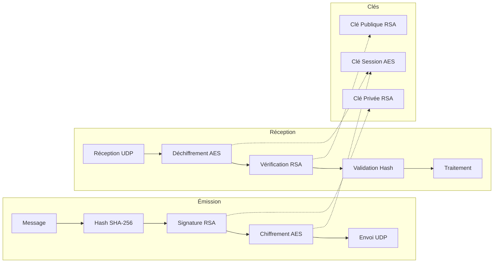
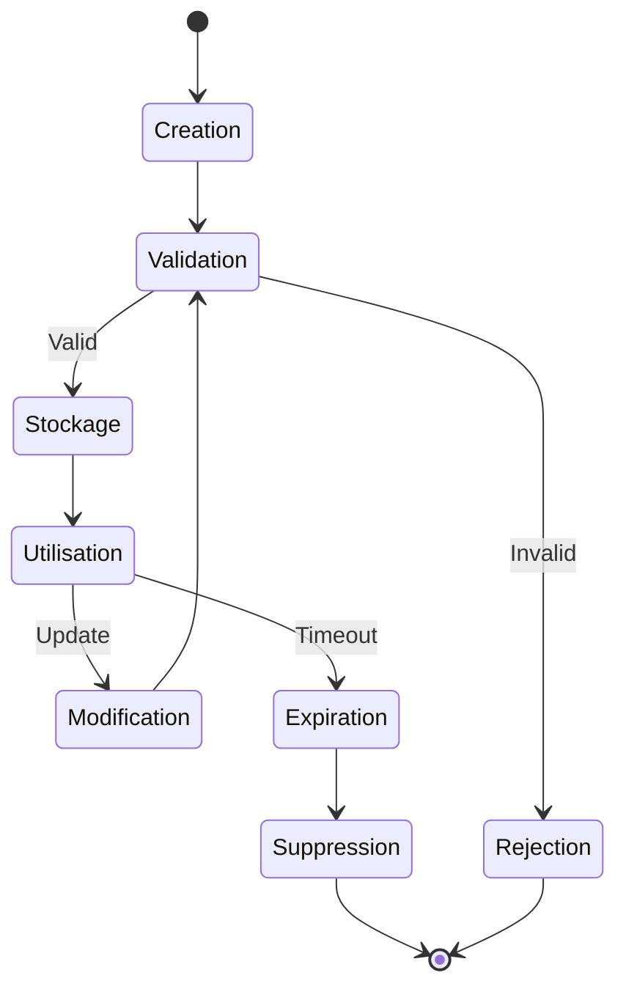

# 🏗️ OpenRed Network - Architecture Technique Détaillée

> **Guide complet de l'architecture pour développeurs et contributeurs**

---

## 📖 Table des matières

1. [🎯 Vue d'ensemble architecturale](#-vue-densemble-architecturale)
2. [📁 Structure modulaire](#-structure-modulaire)
3. [🔗 Diagrammes d'architecture](#-diagrammes-darchitecture)
4. [📡 Protocoles de communication](#-protocoles-de-communication)
5. [🔒 Architecture de sécurité](#-architecture-de-sécurité)
6. [💾 Gestion des données](#-gestion-des-données)
7. [🌐 Architecture réseau](#-architecture-réseau)
8. [🔮 Système de projections](#-système-de-projections)
9. [⚡ Patterns et performances](#-patterns-et-performances)
10. [🔧 Extensibilité](#-extensibilité)

---

## 🎯 Vue d'ensemble architecturale

### 🏛️ Principes architecturaux

OpenRed Network repose sur **5 principes fondamentaux** :

1. **🏰 Fort-centrisme** : Tout gravite autour du concept de fort
2. **🪟 Projections pures** : Jamais de transfert de données réelles
3. **🔒 Sécurité by design** : Cryptographie intégrée à tous les niveaux
4. **📡 Découverte autonome** : Auto-organisation du réseau
5. **📦 Modularité totale** : Architecture composable et évolutive

### 🎨 Pattern architectural global

```
┌─────────────────────────────────────────────────────────────┐
│                     OPENRED NETWORK                         │
├─────────────────────────────────────────────────────────────┤
│  🏰 FORT LAYER (Business Logic)                            │
│  ├── Identité cryptographique                              │
│  ├── Fenêtres publiques/privées                           │
│  └── Gestion du cycle de vie                              │
├─────────────────────────────────────────────────────────────┤
│  🔮 PROJECTION LAYER (Innovation Anti-Copie)              │
│  ├── Format ORN propriétaire                              │
│  ├── Moteur de protection                                 │
│  └── Interface sécurisée                                  │
├─────────────────────────────────────────────────────────────┤
│  🗺️ DISCOVERY LAYER (Network Intelligence)                │
│  ├── Radar automatique                                    │
│  ├── Cartographie dynamique                               │
│  └── Statistiques réseau                                  │
├─────────────────────────────────────────────────────────────┤
│  📡 TRANSPORT LAYER (Communication)                       │
│  ├── Protocole UDP optimisé                               │
│  ├── Messages ORN signés                                  │
│  └── Gestion des connexions                               │
├─────────────────────────────────────────────────────────────┤
│  🔐 CRYPTO LAYER (Security Foundation)                    │
│  ├── RSA 2048 bits                                        │
│  ├── Signatures numériques                                │
│  └── Chiffrement hybride                                  │
└─────────────────────────────────────────────────────────────┘
```

---

## 📁 Structure modulaire

### 🗂️ Organisation des modules

```
openredNetwork/
├── __init__.py                 # 🎯 Point d'entrée centralisé
├── modules/                    # 📦 Modules fonctionnels
│   ├── fort/                  # 🏰 Gestion des forts
│   │   ├── __init__.py       # Exports du module
│   │   ├── identite.py       # IdentiteFort, GenerateurIdentite
│   │   ├── fenetres.py       # FenetrePublique, GestionnaireFenetres
│   │   └── fort.py           # Classe Fort principale
│   ├── cartographie/         # 🗺️ Découverte réseau
│   │   ├── __init__.py       # Exports du module
│   │   ├── carte.py          # CarteReseau, FortSurCarte
│   │   ├── radar.py          # RadarFort, MessageRadar
│   │   └── decouverte.py     # DecouvreurReseau
│   ├── projection/           # 🔮 Système anti-copie
│   │   ├── __init__.py       # Exports du module
│   │   ├── format_orn.py     # FormatProjectionORN
│   │   ├── protection.py     # MoteurAntiCopie
│   │   └── interface.py      # FenetreProjectionSecurisee
│   ├── communication/        # 📡 Transport et protocoles
│   │   ├── __init__.py       # Exports du module
│   │   ├── protocoles.py     # MessageORN, ConstructeurMessages
│   │   └── transport.py      # TransportUDP, GestionnaireConnexions
│   ├── crypto/               # 🔐 Cryptographie
│   │   ├── __init__.py       # Exports du module
│   │   └── chiffrement.py    # ChiffrementRSA, ChiffrementAES
│   └── interface/            # 💻 Interface utilisateur
│       ├── __init__.py       # Exports du module
│       └── gui.py            # InterfacePrincipale
├── test_architecture.py       # ✅ Tests de validation
├── DOCUMENTATION_TECHNIQUE.md # 📚 Documentation complète
└── GUIDE_DEMARRAGE_RAPIDE.md  # 🚀 Guide utilisateur
```

### 🔗 Matrice de dépendances

```
┌─────────────┬─────┬─────┬─────┬─────┬─────┬─────┐
│   Module    │Fort │Carto│Proj │Comm │Cryt │ GUI │
├─────────────┼─────┼─────┼─────┼─────┼─────┼─────┤
│Fort         │  ●  │  -  │  -  │  ●  │  ●  │  -  │
│Cartographie │  -  │  ●  │  -  │  ●  │  -  │  -  │
│Projection   │  -  │  -  │  ●  │  ●  │  ●  │  -  │
│Communication│  -  │  -  │  -  │  ●  │  ●  │  -  │
│Crypto       │  -  │  -  │  -  │  -  │  ●  │  -  │
│Interface    │  ●  │  ●  │  ●  │  -  │  -  │  ●  │
└─────────────┴─────┴─────┴─────┴─────┴─────┴─────┘

● = Dépendance directe
- = Pas de dépendance
```

### 📦 Patterns d'importation

```python
# Pattern 1: Import centralisé (recommandé pour utilisateurs)
import __init__ as openredNetwork
fort = openredNetwork.Fort(...)

# Pattern 2: Import sélectif (recommandé pour développeurs)
from modules.fort import Fort, IdentiteFort
from modules.cartographie import DecouvreurReseau

# Pattern 3: Import complet module (pour extension)
import modules.fort as fort_module
nouvelle_classe = fort_module.IdentiteFort.from_dict(...)
```

---

## 🔗 Diagrammes d'architecture

### 🏗️ Architecture globale



### 🔄 Flux de données



### 🏰 Architecture interne d'un Fort



---

## 📡 Protocoles de communication

### 🔌 Stack protocole ORN

```
┌─────────────────────────────────────────┐
│           APPLICATION LAYER              │
│  ┌─────────────────────────────────────┐ │
│  │    OpenRed Network Messages         │ │
│  │ (Discovery, Projection, Data, etc.) │ │
│  └─────────────────────────────────────┘ │
├─────────────────────────────────────────┤
│            SECURITY LAYER               │
│  ┌─────────────────────────────────────┐ │
│  │      Digital Signatures RSA        │ │
│  │    (Authenticity + Integrity)      │ │
│  └─────────────────────────────────────┘ │
├─────────────────────────────────────────┤
│           TRANSPORT LAYER               │
│  ┌─────────────────────────────────────┐ │
│  │            UDP Protocol             │ │
│  │   (Connectionless, Fast, Simple)   │ │
│  └─────────────────────────────────────┘ │
├─────────────────────────────────────────┤
│            NETWORK LAYER                │
│  ┌─────────────────────────────────────┐ │
│  │         IP (v4/v6 Ready)           │ │
│  │    (LAN + WAN + NAT Traversal)     │ │
│  └─────────────────────────────────────┘ │
└─────────────────────────────────────────┘
```

### 📨 Format message ORN

```json
{
  "version_protocole": "1.0",
  "type_message": "ping|discovery|projection|data",
  "id_message": "msg_[uuid]",
  "timestamp": 1697558400,
  "expediteur": "fort_[hash16]",
  "destinataire": "fort_[hash16]|broadcast",
  "ttl": 300,
  "signature": "base64_rsa_signature",
  "data": {
    // Contenu spécifique au type
  }
}
```

### 🎯 Types de messages détaillés

#### 📍 DISCOVERY Messages
```python
# PING - Test connectivité
{
  "type_message": "ping",
  "data": {
    "message": "Hello, êtes-vous là ?",
    "esperance_reponse": true
  }
}

# PONG - Réponse ping
{
  "type_message": "pong", 
  "data": {
    "message": "Oui, je suis là !",
    "latence_ms": 23
  }
}

# ANNOUNCE - Annonce présence
{
  "type_message": "announce",
  "data": {
    "nom_fort": "Alice",
    "services": ["chat", "partage", "projection"],
    "fenetre_publique": {...},
    "version_protocole": "1.0"
  }
}
```

#### 🔮 PROJECTION Messages
```python
# PROJECTION_INVITE - Invitation à projection
{
  "type_message": "projection_invite",
  "data": {
    "id_projection": "ORN_[uuid]",
    "titre": "Document confidentiel",
    "niveau_protection": 3,
    "duree_vie": 3600,
    "permissions": ["lecture"]
  }
}

# PROJECTION_ACCEPT - Acceptation
{
  "type_message": "projection_accept",
  "data": {
    "id_projection": "ORN_[uuid]",
    "session_id": "sess_[uuid]",
    "cle_session_chiffree": "base64_aes_key"
  }
}

# PROJECTION_DATA - Données projection
{
  "type_message": "projection_data",
  "data": {
    "session_id": "sess_[uuid]",
    "fragment_id": 1,
    "total_fragments": 5,
    "contenu_chiffre": "base64_encrypted_data",
    "watermark": "invisible_trace"
  }
}
```

---

## 🔒 Architecture de sécurité

### 🛡️ Modèle de sécurité multi-niveaux

```
┌─────────────────────────────────────────┐
│         NIVEAU 4: APPLICATION          │
│  • Validation métier                   │
│  • Contrôles d'accès applicatifs       │
│  • Audit et logging                    │
├─────────────────────────────────────────┤
│         NIVEAU 3: PROJECTION           │
│  • Anti-copie et watermarking          │
│  • Contrôle de session                 │
│  • Monitoring des violations           │
├─────────────────────────────────────────┤
│         NIVEAU 2: TRANSPORT            │
│  • Signatures numériques               │
│  • Chiffrement bout-à-bout              │
│  • Protection anti-replay              │
├─────────────────────────────────────────┤
│         NIVEAU 1: IDENTITÉ              │
│  • Clés RSA 2048 bits                  │
│  • Génération cryptographique forte    │
│  • Authentification mutuelle           │
└─────────────────────────────────────────┘
```

### 🔐 Pipeline cryptographique



### 🚨 Détection des menaces

```python
class SecurityMonitor:
    def detecter_menaces(self, message: MessageORN) -> List[str]:
        menaces = []
        
        # Détection replay attack
        if self.timestamp_deja_vu(message.timestamp):
            menaces.append("REPLAY_ATTACK")
        
        # Détection signature invalide
        if not self.verifier_signature(message):
            menaces.append("SIGNATURE_FORGERY")
        
        # Détection flooding
        if self.trop_de_messages(message.expediteur):
            menaces.append("FLOODING_ATTACK")
        
        # Détection contenu malveillant
        if self.contenu_suspect(message.data):
            menaces.append("MALICIOUS_CONTENT")
        
        return menaces
```

---

## 💾 Gestion des données

### 🗄️ Modèle de données

```python
@dataclass
class IdentiteFort:
    """Identité immuable d'un fort"""
    id_fort: str          # fort_[hash16]
    nom: str              # Nom choisi par l'utilisateur
    adresse_orp: str      # orp://fort_id.openred
    cle_publique: str     # PEM RSA 2048 bits
    timestamp_creation: str # ISO 8601

@dataclass 
class FenetrePublique:
    """Données publiques d'un fort"""
    profil_public: Dict   # Informations visibles
    publications: List    # Messages publics
    services: List        # Services offerts
    statistiques: Dict    # Métriques non-sensibles

@dataclass
class ProjectionORN:
    """Projection anti-copie"""
    id_projection: str    # ORN_[uuid]
    type_contenu: str     # texte|image|document
    metadonnees: Dict     # Titre, description, etc.
    contenu_protege: bytes # Contenu chiffré fragmenté
    watermark: str        # Traçabilité invisible
    restrictions: List    # Protections actives
```

### 🔄 Cycle de vie des données



### 💾 Stratégies de stockage

```python
class GestionnaireStockage:
    """Gestion intelligente du stockage"""
    
    def __init__(self):
        self.cache_memoire = {}     # Accès rapide
        self.stockage_temporaire = {} # Sessions actives
        # PAS de stockage persistant par défaut (sécurité)
    
    def stocker_temporaire(self, cle: str, donnees: Any, ttl: int):
        """Stockage avec expiration automatique"""
        expiration = time.time() + ttl
        self.stockage_temporaire[cle] = {
            'donnees': donnees,
            'expiration': expiration
        }
    
    def nettoyer_expires(self):
        """Nettoyage automatique"""
        maintenant = time.time()
        expires = [
            cle for cle, valeur in self.stockage_temporaire.items()
            if valeur['expiration'] < maintenant
        ]
        for cle in expires:
            del self.stockage_temporaire[cle]
```

---

## 🌐 Architecture réseau

### 📡 Topologie réseau

```
┌─────────────────────────────────────────────────────────┐
│                    INTERNET                             │
│  ┌─────────────┐      ┌─────────────┐                   │
│  │   Fort A    │◄────►│   Fort B    │                   │
│  │ (Paris)     │      │ (Tokyo)     │                   │
│  └─────────────┘      └─────────────┘                   │
└─────────────────────────────────────┬───────────────────┘
                                      │
┌─────────────────────────────────────┼───────────────────┐
│                 LAN 1               │      LAN 2        │
│  ┌─────────────┐ ┌─────────────┐    │ ┌─────────────┐   │
│  │   Fort C    │ │   Fort D    │    │ │   Fort E    │   │
│  │ (192.168    │ │ (192.168    │    │ │ (10.0.0     │   │
│  │  .1.10)     │ │  .1.20)     │    │ │  .100)      │   │
│  └─────────────┘ └─────────────┘    │ └─────────────┘   │
│        │              │             │        │          │
│        └──────────────┼─────────────┘        │          │
│                       │                      │          │
│              ┌─────────────┐        ┌─────────────┐     │
│              │   Fort F    │        │   Fort G    │     │
│              │ (192.168    │        │ (10.0.0     │     │
│              │  .1.30)     │        │  .200)      │     │
│              └─────────────┘        └─────────────┘     │
└─────────────────────────────────────────────────────────┘
```

### 🔍 Algorithme de découverte

```python
class AlgorithmeDecouverte:
    """Stratégie de découverte multi-niveaux"""
    
    def decouvrir_reseau(self):
        # Niveau 1: Réseau local (rapide)
        forts_locaux = self.scanner_reseau_local()
        
        # Niveau 2: Cache des forts connus (moyen)
        forts_caches = self.consulter_cache_forts()
        
        # Niveau 3: Réseau étendu (lent)
        forts_etendus = self.scanner_reseau_etendu()
        
        return self.fusionner_resultats([
            forts_locaux, forts_caches, forts_etendus
        ])
    
    def scanner_reseau_local(self) -> List[Fort]:
        """Scan rapide du réseau local"""
        # Broadcast UDP sur plages privées
        plages = [
            "192.168.0.0/16",   # Réseau domestique
            "10.0.0.0/8",       # Réseau entreprise
            "172.16.0.0/12"     # Réseau cloud
        ]
        
        forts_trouves = []
        for plage in plages:
            forts_trouves.extend(
                self.ping_plage_ip(plage)
            )
        
        return forts_trouves
```

### 🔄 Gestion des connexions

```python
class GestionnaireConnexions:
    """Pool de connexions optimisé"""
    
    def __init__(self, taille_pool: int = 50):
        self.connexions_actives = {}
        self.pool_reutilisable = Queue(taille_pool)
        self.statistiques = {
            'connexions_creees': 0,
            'connexions_reutilisees': 0,
            'connexions_fermees': 0
        }
    
    def obtenir_connexion(self, adresse: str) -> ConnexionUDP:
        """Obtient connexion réutilisable ou en crée une"""
        if adresse in self.connexions_actives:
            self.statistiques['connexions_reutilisees'] += 1
            return self.connexions_actives[adresse]
        
        # Réutiliser du pool si possible
        try:
            connexion = self.pool_reutilisable.get_nowait()
            connexion.reconfigurer(adresse)
        except Empty:
            connexion = ConnexionUDP(adresse)
            self.statistiques['connexions_creees'] += 1
        
        self.connexions_actives[adresse] = connexion
        return connexion
```

---

## 🔮 Système de projections

### 🎭 Architecture anti-copie

```
┌─────────────────────────────────────────────────────────┐
│                  PROJECTION PIPELINE                    │
├─────────────────────────────────────────────────────────┤
│  1. PRÉPARATION                                         │
│     • Analyse contenu                                   │
│     • Génération watermark invisible                    │
│     • Fragmentation sécurisée                          │
├─────────────────────────────────────────────────────────┤
│  2. TRANSMISSION                                        │
│     • Chiffrement par fragments                         │
│     • Transmission étalée dans le temps                │
│     • Pas de stockage côté observateur                 │
├─────────────────────────────────────────────────────────┤
│  3. AFFICHAGE                                           │
│     • Interface protégée                               │
│     • Reconstruction en mémoire uniquement             │
│     • Surveillance continue des violations             │
├─────────────────────────────────────────────────────────┤
│  4. PROTECTION                                          │
│     • Blocage copier/coller                            │
│     • Détection captures d'écran                       │
│     • Expiration automatique                           │
└─────────────────────────────────────────────────────────┘
```

### 🛡️ Niveaux de protection détaillés

```python
class NiveauxProtection:
    """Définition des niveaux de protection"""
    
    NIVEAU_1_BASIQUE = {
        'copie_texte': False,
        'screenshot_watermark': True,
        'duree_max_session': None,
        'surveillance_continue': False
    }
    
    NIVEAU_2_RENFORCE = {
        'copie_texte': False,
        'screenshot_detection': True,
        'screenshot_alerte': True,
        'duree_max_session': 7200,  # 2 heures
        'surveillance_continue': True
    }
    
    NIVEAU_3_MAXIMUM = {
        'copie_texte': False,
        'screenshot_blocked': True,
        'screen_recording_detection': True,
        'watermark_invisible': True,
        'duree_max_session': 1800,  # 30 minutes
        'surveillance_continue': True,
        'audit_complet': True
    }
```

### 🔍 Système de watermarking

```python
class MoteurWatermark:
    """Génération et détection de watermarks"""
    
    def generer_watermark_invisible(self, 
                                  contenu: str, 
                                  id_observateur: str,
                                  timestamp: int) -> str:
        """Génère watermark invisible unique"""
        
        # Création signature unique
        signature = f"{id_observateur}:{timestamp}:{random.randint(1000, 9999)}"
        hash_signature = hashlib.sha256(signature.encode()).hexdigest()[:16]
        
        # Injection invisible dans le contenu
        # Utilise des caractères Unicode invisibles
        watermark_chars = self.hash_to_invisible_chars(hash_signature)
        
        # Insertion à positions calculées
        positions = self.calculer_positions_insertion(len(contenu), hash_signature)
        contenu_watermarked = self.inserer_watermark(
            contenu, watermark_chars, positions
        )
        
        return contenu_watermarked
    
    def detecter_watermark(self, contenu_suspect: str) -> Optional[Dict]:
        """Détecte et décode un watermark"""
        chars_invisibles = self.extraire_chars_invisibles(contenu_suspect)
        
        if not chars_invisibles:
            return None
        
        hash_extrait = self.invisible_chars_to_hash(chars_invisibles)
        return {
            'watermark_detecte': True,
            'hash_signature': hash_extrait,
            'timestamp_detection': time.time()
        }
```

---

## ⚡ Patterns et performances

### 🚀 Optimisations mémoire

```python
class OptimisationsMemoire:
    """Patterns d'optimisation mémoire"""
    
    def __init__(self):
        # Pool d'objets réutilisables
        self.pool_messages = []
        self.pool_connexions = []
        
        # Cache avec expiration intelligente
        self.cache_lru = LRUCache(maxsize=1000)
        
        # Compression automatique
        self.compresseur = CompressionZlib()
    
    def obtenir_message_recycle(self) -> MessageORN:
        """Réutilise objets message pour éviter GC"""
        if self.pool_messages:
            message = self.pool_messages.pop()
            message.reset()
            return message
        return MessageORN()
    
    def recycler_message(self, message: MessageORN):
        """Remet message dans le pool"""
        if len(self.pool_messages) < 100:  # Limite taille pool
            self.pool_messages.append(message)
```

### ⚡ Optimisations réseau

```python
class OptimisationsReseau:
    """Patterns d'optimisation réseau"""
    
    def __init__(self):
        self.batch_messages = []
        self.dernier_envoi = 0
        self.compression_seuil = 1024  # 1KB
    
    def envoyer_optimise(self, message: MessageORN, adresse: str):
        """Envoi optimisé avec batching et compression"""
        
        # Batching pour petits messages
        if len(message.to_json()) < 500:  # < 500 bytes
            self.batch_messages.append((message, adresse))
            
            # Envoi batch si assez de messages ou timeout
            if (len(self.batch_messages) >= 10 or 
                time.time() - self.dernier_envoi > 0.1):
                self.envoyer_batch()
        else:
            # Envoi direct pour gros messages
            self.envoyer_direct(message, adresse)
    
    def envoyer_batch(self):
        """Envoi groupé de messages"""
        if not self.batch_messages:
            return
        
        # Grouper par adresse destination
        groupes = defaultdict(list)
        for message, adresse in self.batch_messages:
            groupes[adresse].append(message)
        
        # Envoi groupé par destination
        for adresse, messages in groupes.items():
            batch_message = self.creer_message_batch(messages)
            self.transport.envoyer(batch_message, adresse)
        
        self.batch_messages.clear()
        self.dernier_envoi = time.time()
```

### 📊 Monitoring performances

```python
class MoniteurPerformances:
    """Surveillance performance en temps réel"""
    
    def __init__(self):
        self.metriques = {
            'messages_par_seconde': RateMeter(),
            'latence_moyenne': AverageMeter(),
            'utilisation_memoire': MemoryTracker(),
            'erreurs_reseau': ErrorCounter()
        }
    
    def mesurer_operation(self, nom_operation: str):
        """Décorateur pour mesurer performances"""
        def decorator(func):
            def wrapper(*args, **kwargs):
                start_time = time.perf_counter()
                start_memory = self.metriques['utilisation_memoire'].current()
                
                try:
                    result = func(*args, **kwargs)
                    self.metriques[f'{nom_operation}_succes'].increment()
                    return result
                except Exception as e:
                    self.metriques[f'{nom_operation}_erreur'].increment()
                    raise
                finally:
                    # Mesure temps
                    duree = time.perf_counter() - start_time
                    self.metriques[f'{nom_operation}_duree'].add(duree)
                    
                    # Mesure mémoire
                    delta_memory = (self.metriques['utilisation_memoire'].current() 
                                  - start_memory)
                    self.metriques[f'{nom_operation}_memoire'].add(delta_memory)
            
            return wrapper
        return decorator
```

---

## 🔧 Extensibilité

### 🧩 Interface d'extension

```python
class ExtensionInterface:
    """Interface pour extensions tierces"""
    
    def __init__(self, nom_extension: str):
        self.nom = nom_extension
        self.version = "1.0.0"
        self.dependencies = []
    
    def on_fort_creation(self, fort: Fort) -> None:
        """Hook: Création d'un fort"""
        pass
    
    def on_message_received(self, message: MessageORN) -> bool:
        """Hook: Réception message (return True si traité)"""
        pass
    
    def on_projection_created(self, projection: ProjectionORN) -> None:
        """Hook: Création projection"""
        pass
    
    def register_custom_message_type(self, type_name: str, handler: Callable):
        """Enregistre nouveau type de message"""
        MessageRegistry.register(type_name, handler)
```

### 📦 Système de plugins

```python
class GestionnairePlugins:
    """Gestionnaire de plugins dynamiques"""
    
    def __init__(self):
        self.plugins_charges = {}
        self.hooks = defaultdict(list)
    
    def charger_plugin(self, chemin_plugin: str) -> bool:
        """Charge dynamiquement un plugin"""
        try:
            spec = importlib.util.spec_from_file_location("plugin", chemin_plugin)
            module = importlib.util.module_from_spec(spec)
            spec.loader.exec_module(module)
            
            # Recherche classe plugin
            for nom, obj in inspect.getmembers(module):
                if (inspect.isclass(obj) and 
                    issubclass(obj, ExtensionInterface) and 
                    obj != ExtensionInterface):
                    
                    plugin = obj()
                    self.plugins_charges[plugin.nom] = plugin
                    self.enregistrer_hooks(plugin)
                    return True
            
        except Exception as e:
            logger.error(f"Erreur chargement plugin {chemin_plugin}: {e}")
            return False
    
    def executer_hook(self, nom_hook: str, *args, **kwargs):
        """Exécute tous les hooks d'un type"""
        for handler in self.hooks[nom_hook]:
            try:
                handler(*args, **kwargs)
            except Exception as e:
                logger.error(f"Erreur hook {nom_hook}: {e}")
```

### 🔮 Création de nouveaux types de projection

```python
class ProjectionPersonnalisee(FormatProjectionORN):
    """Exemple d'extension de projection"""
    
    def __init__(self, type_contenu: str = "custom"):
        super().__init__(type_contenu)
        self.protections_custom = {}
    
    def ajouter_protection_custom(self, nom: str, fonction: Callable):
        """Ajoute protection personnalisée"""
        self.protections_custom[nom] = fonction
    
    def appliquer_protections(self, contenu: Any) -> Any:
        """Applique protections standard + custom"""
        # Protections de base
        contenu_protege = super().appliquer_protections(contenu)
        
        # Protections personnalisées
        for nom, fonction in self.protections_custom.items():
            contenu_protege = fonction(contenu_protege)
        
        return contenu_protege

# Utilisation
projection_custom = ProjectionPersonnalisee()
projection_custom.ajouter_protection_custom(
    "obfuscation_avancee", 
    lambda x: self.obfusquer_contenu_avance(x)
)
```

### 🌐 Extension des protocoles réseau

```python
class ProtocolePersonnalise:
    """Extension du protocole ORN"""
    
    def __init__(self):
        self.types_messages_custom = {}
    
    def definir_nouveau_type(self, nom_type: str, schema: Dict):
        """Définit nouveau type de message"""
        self.types_messages_custom[nom_type] = {
            'schema': schema,
            'version': '1.0',
            'handler': None
        }
    
    def enregistrer_handler(self, nom_type: str, handler: Callable):
        """Enregistre gestionnaire pour type custom"""
        if nom_type in self.types_messages_custom:
            self.types_messages_custom[nom_type]['handler'] = handler

# Exemple d'extension
protocole_custom = ProtocolePersonnalise()

# Nouveau type: notification
protocole_custom.definir_nouveau_type("notification", {
    "titre": str,
    "message": str,
    "priorite": int,
    "actions": List[Dict]
})

def traiter_notification(message: MessageORN):
    """Traite notifications custom"""
    data = message.data
    afficher_notification(
        titre=data["titre"],
        message=data["message"],
        priorite=data["priorite"]
    )

protocole_custom.enregistrer_handler("notification", traiter_notification)
```

---

## 📊 Métriques et observabilité

### 📈 Dashboard de métriques

```python
class DashboardMetriques:
    """Collecte et affichage métriques système"""
    
    def __init__(self):
        self.collecteurs = [
            MetriquesFort(),
            MetriquesReseau(), 
            MetriquesProjections(),
            MetriquesSecurite()
        ]
    
    def collecter_toutes_metriques(self) -> Dict:
        """Collecte complète des métriques"""
        metriques = {
            'timestamp': time.time(),
            'uptime': self.calculer_uptime(),
            'modules': {}
        }
        
        for collecteur in self.collecteurs:
            nom_module = collecteur.__class__.__name__
            metriques['modules'][nom_module] = collecteur.collecter()
        
        return metriques
    
    def generer_rapport_sante(self) -> Dict:
        """Rapport de santé du système"""
        metriques = self.collecter_toutes_metriques()
        
        sante = {
            'statut_global': 'SAIN',
            'alertes': [],
            'recommandations': []
        }
        
        # Analyse automatique
        if metriques['modules']['MetriquesReseau']['erreurs_reseau'] > 10:
            sante['alertes'].append("Taux d'erreurs réseau élevé")
            sante['statut_global'] = 'ATTENTION'
        
        if metriques['modules']['MetriquesSecurite']['violations_detectees'] > 0:
            sante['alertes'].append("Violations de sécurité détectées")
            sante['statut_global'] = 'CRITIQUE'
        
        return sante
```

---

*🏗️ Documentation architecture générée pour OpenRed Network v1.0.0*  
*📅 Dernière mise à jour: 17 octobre 2025*  
*👥 Destiné aux développeurs et contributeurs avancés*