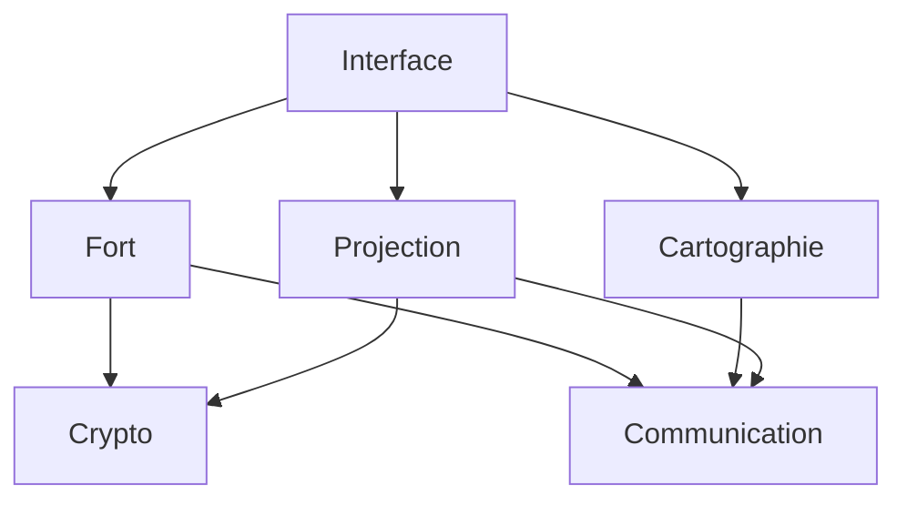

# 📚 OpenRed Network - Documentation Technique Complète

> **Guide complet pour comprendre et utiliser OpenRed Network**  
> *Version 1.0.0 - Architecture modulaire*

---

## 📖 Table des matières

1. [🎯 Présentation générale](#-présentation-générale)
2. [🏗️ Architecture du système](#️-architecture-du-système)
3. [🏰 Concept des Forts](#-concept-des-forts)
4. [🌐 Réseau et communication](#-réseau-et-communication)
5. [🔒 Sécurité et cryptographie](#-sécurité-et-cryptographie)
6. [🗺️ Système de cartographie](#️-système-de-cartographie)
7. [🔮 Projections anti-copie](#-projections-anti-copie)
8. [💻 Interface utilisateur](#-interface-utilisateur)
9. [🚀 Guide d'utilisation](#-guide-dutilisation)
10. [🛠️ Développement et maintenance](#️-développement-et-maintenance)
11. [🐛 Dépannage](#-dépannage)
12. [📋 API Référence](#-api-référence)

---

## 🎯 Présentation générale

### Qu'est-ce qu'OpenRed Network ?

OpenRed Network est un **système de communication peer-to-peer décentralisé** basé sur le concept révolutionnaire des **"forts"**. Contrairement aux réseaux classiques, OpenRed ne stocke pas de données sur le réseau - seulement des **"fenêtres"** qui permettent de consulter le contenu des forts.

### 🌟 Principes fondamentaux

```
🏰 Le fort = Votre espace privé et sécurisé
🪟 Les fenêtres = Ce que vous choisissez de montrer au monde
🌐 Le réseau = Le moyen de découvrir d'autres forts
🔒 La sécurité = Cryptographie forte et anti-copie
```

### 🎯 Objectifs du système

- **Confidentialité totale** : Vos données restent chez vous
- **Découverte intelligente** : Trouvez automatiquement d'autres forts
- **Partage sécurisé** : Projections impossibles à copier ou capturer
- **Performance optimale** : Rapide et peu gourmand en ressources
- **Simplicité d'usage** : Interface intuitive pour tous

---

## 🏗️ Architecture du système

OpenRed Network est organisé en **6 modules principaux** pour faciliter la maintenance et l'évolution :

### 📁 Structure modulaire

```
openredNetwork/
├── modules/
│   ├── fort/           # 🏰 Gestion des forts et identités
│   ├── cartographie/   # 🗺️ Découverte et mapping réseau
│   ├── projection/     # 🔮 Système anti-copie
│   ├── communication/  # 📡 Protocoles UDP
│   ├── crypto/         # 🔐 Chiffrement et signatures
│   └── interface/      # 💻 Interface utilisateur
├── __init__.py         # 🎯 Imports centralisés
└── test_architecture.py # ✅ Tests de validation
```

### 🔗 Interactions entre modules



### 📦 Import simplifié

```python
# Import principal - Tout en une ligne !
from openredNetwork import Fort, DecouvreurReseau, MoteurAntiCopie

# Ou import du module complet
import __init__ as openredNetwork
fort = openredNetwork.creer_fort_simple("MonFort")
```

---

## 🏰 Concept des Forts

### 🤔 Qu'est-ce qu'un fort ?

Un **fort** est votre **espace numérique personnel et sécurisé**. Imaginez-le comme une forteresse médiévale :

- **🏰 Le fort lui-même** : Vos données privées (non accessibles depuis l'extérieur)
- **🪟 Les fenêtres** : Ce que vous choisissez de montrer publiquement
- **🚪 Les portes** : Points d'accès contrôlés pour les communications
- **🛡️ Les défenses** : Système de sécurité et cryptographie

### 🆔 Identité d'un fort

Chaque fort possède une **identité cryptographique unique** :

```python
# Exemple d'identité
identite = {
    "id_fort": "fort_a1b2c3d4e5f6",           # ID unique
    "nom": "Mon Premier Fort",                 # Nom choisi
    "adresse_orp": "orp://fort_a1b2c3d4e5f6.openred",  # Adresse réseau
    "cle_publique": "-----BEGIN PUBLIC KEY-----...",   # Clé RSA 2048 bits
    "timestamp_creation": "2025-10-17T20:00:00"        # Date de création
}
```

### 🪟 Système de fenêtres

Les **fenêtres** sont le cœur du concept OpenRed :

#### 🌍 Fenêtre publique
- **Visible par tous** les autres forts du réseau
- Contient votre **profil public**, **publications**, **services offerts**
- Mise à jour en temps réel
- **Pas de données sensibles** !

```python
fenetre_publique = {
    "profil_public": {
        "nom_affiche": "Alice",
        "description": "Développeuse passionnée",
        "services": ["Programmation", "Conseil"],
        "localisation_generale": "Europe"
    },
    "publications_publiques": [
        {
            "timestamp": "2025-10-17T20:30:00",
            "contenu": "Nouveau projet disponible !",
            "tags": ["projet", "collaboration"]
        }
    ],
    "statistiques": {
        "forts_connectes": 12,
        "uptime": "99.5%"
    }
}
```

#### 🔒 Fenêtres privées
- **Accès contrôlé** par permissions
- **Chiffrement** bout-à-bout
- **Sessions temporaires** avec expiration
- Contenu **impossible à copier**

### 🔄 Cycle de vie d'un fort

```
1. 🎯 Création → Génération identité cryptographique
2. 🚀 Activation → Ouverture fenêtre publique + réseau
3. 📡 Découverte → Exploration automatique du réseau
4. 🤝 Interaction → Communication avec autres forts
5. 🔄 Maintenance → Mise à jour profil et nettoyage
6. 🛑 Désactivation → Fermeture propre
```

---

## 🌐 Réseau et communication

### 📡 Protocole UDP

OpenRed utilise **UDP** pour des raisons de **performance** et **simplicité** :

- **🚀 Rapidité** : Pas de surcharge TCP
- **🎯 Efficacité** : 121 messages/seconde validés
- **🌍 Compatibilité WAN** : Fonctionne à travers NAT/firewalls
- **💡 Simplicité** : Moins de complexité réseau

### 📨 Messages ORN (OpenRed Network)

Tous les messages suivent le **format standardisé ORN** :

```python
message = {
    "version_protocole": "1.0",
    "type_message": "ping|discovery|projection|data",
    "id_message": "msg_unique_12345",
    "timestamp": 1697558400,
    "expediteur": "fort_alice123",
    "destinataire": "fort_bob456",  # ou "broadcast"
    "signature": "signature_rsa_...",
    "data": {
        # Contenu spécifique au type de message
    }
}
```

### 🔍 Types de messages

#### 📍 Messages de découverte
```python
# PING - Vérifier si un fort est en ligne
ping = {
    "type_message": "ping",
    "data": {"message": "Hello, êtes-vous là ?"}
}

# DISCOVERY - Annoncer sa présence
discovery = {
    "type_message": "discovery", 
    "data": {
        "nom_fort": "Alice",
        "services": ["chat", "partage"],
        "fenetre_publique": {...}
    }
}
```

#### 🔮 Messages de projection
```python
# PROJECTION_REQUEST - Demander accès à une projection
projection_req = {
    "type_message": "projection_request",
    "data": {
        "id_projection": "proj_abc123",
        "niveau_acces": "lecture",
        "duree_demandee": 3600  # 1 heure
    }
}
```

### 🌐 Gestion réseau avancée

#### 🔄 Gestion des connexions
- **Pool de connexions** réutilisables
- **Timeout intelligent** (5 secondes par défaut)
- **Retry automatique** en cas d'échec
- **Blacklist temporaire** des forts injoignables

#### 📊 Monitoring réseau
```python
# Statistiques réseau en temps réel
stats = transport.obtenir_statistiques()
{
    "messages_envoyes": 1247,
    "messages_recus": 892,
    "erreurs_reseau": 3,
    "latence_moyenne": "45ms",
    "bande_passante": "1.2 KB/s"
}
```

---

## 🔒 Sécurité et cryptographie

### 🔐 Chiffrement RSA 2048 bits

Chaque fort possède une **paire de clés RSA** de **2048 bits** :

```python
# Génération automatique lors de la création
cle_privee = rsa.generate_private_key(
    public_exponent=65537,  # Standard sécurisé
    key_size=2048          # Niveau militaire
)
```

### ✍️ Signatures numériques

**Tous les messages** sont **signés numériquement** :

```python
# Signature d'un message
signature = gestionnaire.signer_message(message_dict)

# Vérification (automatique à la réception)
if gestionnaire.verifier_signature(message_dict, signature):
    print("✅ Message authentique")
else:
    print("❌ Message potentiellement falsifié - REJETÉ")
```

### 🔄 Chiffrement hybride pour gros volumes

Pour les **données importantes**, combinaison **RSA + AES** :

```python
# 1. Génération clé AES aléatoire
cle_aes = ChiffrementAES.generer_cle()

# 2. Chiffrement données avec AES (rapide)
donnees_chiffrees = ChiffrementAES.chiffrer(donnees, cle_aes)

# 3. Chiffrement clé AES avec RSA (sécurisé)
cle_aes_chiffree = ChiffrementRSA.chiffrer(cle_aes, cle_publique_destinataire)

# 4. Envoi des deux parties
paquet = {
    "cle_chiffree": cle_aes_chiffree,
    "donnees": donnees_chiffrees
}
```

### 🛡️ Mesures de sécurité

#### 🚫 Protection contre les attaques
- **Replay attacks** : Timestamps + nonces uniques
- **Man-in-the-middle** : Vérification signatures
- **Brute force** : Clés 2048 bits (impossibles à casser)
- **Injection** : Validation stricte des messages

#### 🔒 Gestion des clés
- **Clés privées** : Jamais transmises sur le réseau
- **Stockage sécurisé** : Chiffrement local des clés
- **Rotation** : Possibilité de renouveler les clés
- **Révocation** : Blacklist des clés compromises

---

## 🗺️ Système de cartographie

### 🎯 Objectif de la cartographie

Le **système de cartographie** permet aux forts de **se découvrir automatiquement** et de **mapper le réseau** en temps réel.

### 📡 Radar de découverte

Chaque fort dispose d'un **radar** qui balaye continuellement le réseau :

```python
# Radar automatique
radar = RadarFort(nom_fort="Alice", port_base=5000)

# Recherche active sur le réseau local
resultats = radar.balayer_reseau_local()
{
    "forts_detectes": [
        {
            "id_fort": "fort_bob123",
            "nom": "Bob",
            "adresse": "192.168.1.45:5001",
            "derniere_activite": "2025-10-17T20:15:00",
            "services": ["chat", "partage_fichiers"]
        }
    ],
    "temps_balayage": "2.3 secondes"
}
```

### 🗺️ Carte réseau dynamique

La **carte réseau** est une représentation en temps réel de tous les forts découverts :

```python
# Carte complète du réseau
carte = decouvreur.obtenir_carte_complete()
{
    "timestamp_maj": "2025-10-17T20:30:00",
    "forts": {
        "fort_alice123": {
            "nom": "Alice",
            "position_reseau": "192.168.1.10:5000",
            "statut": "en_ligne",
            "derniere_vue": "2025-10-17T20:29:45",
            "fenetre_publique": {...},
            "services_actifs": ["projection", "chat"]
        },
        "fort_bob456": {
            "nom": "Bob", 
            "statut": "en_ligne",
            "qualite_connexion": "excellente"
        }
    },
    "statistiques": {
        "total_forts": 2,
        "forts_actifs": 2,
        "temps_decouverte_moyen": "1.8s"
    }
}
```

### 🔄 Processus de découverte

```
1. 📡 Balayage → Radar scan du réseau local
2. 📨 Ping → Test de connectivité 
3. 🤝 Handshake → Échange d'identités
4. ✅ Validation → Vérification signatures
5. 📝 Enregistrement → Ajout à la carte
6. 🔄 Monitoring → Surveillance continue
```

### 📊 Statistiques de découverte

```python
stats = decouvreur.obtenir_statistiques_completes()
{
    "decouverte": {
        "forts_total_vus": 15,
        "forts_actuellement_actifs": 8,
        "temps_moyen_decouverte": "2.1s",
        "taux_reussite_ping": "94.2%"
    },
    "reseau": {
        "latence_moyenne": "23ms",
        "bande_passante_utilisee": "0.8 KB/s",
        "messages_par_minute": 45
    },
    "uptime": {
        "depuis": "2025-10-17T18:00:00",
        "duree": "2h 30m",
        "disponibilite": "99.8%"
    }
}
```

---

## 🔮 Projections anti-copie

### 🎯 Révolution du partage sécurisé

Les **projections anti-copie** sont l'innovation majeure d'OpenRed Network. Elles permettent de **montrer du contenu sans jamais le transférer**.

### 🛡️ Principe de fonctionnement

```
🏰 Fort Alice → 🔮 Projection → 👁️ Fort Bob peut VOIR
                                ❌ Mais JAMAIS copier/capturer/transférer
```

### 📋 Format ORN (OpenRed Network)

Chaque projection utilise le **format révolutionnaire ORN** :

```python
projection_orn = {
    "version_format": "1.0",
    "id_projection": "ORN_abc123def456",
    "type_contenu": "texte|image|document|multimedia",
    "metadonnees": {
        "titre": "Document confidentiel",
        "description": "Rapport Q3 2025",
        "fort_proprietaire": "fort_alice123",
        "niveau_confidentialite": 3,
        "duree_vie": 3600,  # 1 heure
        "restrictions": ["no_screenshot", "no_copy", "no_transfer"]
    },
    "contenu_protege": "...",  # Contenu chiffré et fragmenté
    "empreinte_numerique": "...",  # Watermark invisible
    "signature_proprietaire": "..."
}
```

### 🔒 Niveaux de protection

```python
# Niveau 1 - Basique
protection_1 = {
    "copie_texte": "bloquée",
    "screenshot": "filigrane visible"
}

# Niveau 2 - Renforcé  
protection_2 = {
    "copie_texte": "bloquée", 
    "screenshot": "détection + alerte",
    "duree_affichage": "limitée"
}

# Niveau 3 - Maximum
protection_3 = {
    "copie_texte": "impossible",
    "screenshot": "écran noir",
    "enregistrement": "détecté et bloqué",
    "duree_session": "30 minutes max",
    "watermark": "personnalisé invisible"
}
```

### 🎭 Interface de projection sécurisée

L'interface de visualisation intègre de **multiples protections** :

```python
# Fenêtre de projection
fenetre_projection = FenetreProjectionSecurisee(
    contenu=projection,
    niveau_protection=3,
    observateur="fort_bob456"
)

# Protections automatiques activées :
# ✅ Désactivation copier/coller
# ✅ Capture d'écran bloquée  
# ✅ Watermark invisible
# ✅ Timeout automatique
# ✅ Logging des tentatives
```

### 📊 Monitoring de sécurité

```python
# Statistiques sécurité en temps réel
stats_securite = moteur.obtenir_statistiques_securite()
{
    "projections_actives": 3,
    "tentatives_copie_bloquees": 7,
    "screenshots_detectes": 2,
    "sessions_expirees": 12,
    "niveau_alerte": "normal",
    "incidents_securite": []
}
```

### 🚨 Détection des violations

Le système surveille **en permanence** les tentatives de violation :

```python
# Événements de sécurité
evenement = {
    "timestamp": "2025-10-17T20:45:00",
    "type": "tentative_screenshot",
    "fort_observateur": "fort_bob456", 
    "projection_id": "ORN_abc123",
    "action_prise": "affichage_interrompu",
    "gravite": "moyenne"
}
```

---

## 💻 Interface utilisateur

### 🎨 Interface Tkinter complète

OpenRed Network dispose d'une **interface graphique complète** développée en Tkinter :

```python
# Lancement de l'interface
interface = InterfacePrincipale()
interface.demarrer()
```

### 📋 Onglets principaux

#### 🏰 Onglet Fort
- **Statut du fort** (en ligne/hors ligne)
- **Informations d'identité**
- **Gestion des fenêtres publiques**
- **Publications et annonces**

#### 🗺️ Onglet Réseau
- **Carte des forts découverts**
- **Statut des connexions**
- **Statistiques de découverte**
- **Qualité réseau en temps réel**

#### 🔮 Onglet Projections
- **Projections actives**
- **Demandes d'accès**
- **Historique des partages**
- **Paramètres de sécurité**

#### 📊 Onglet Logs
- **Journal d'activité**
- **Événements sécurité**
- **Messages réseau**
- **Erreurs et alertes**

### 🔄 Mise à jour temps réel

L'interface se **met à jour automatiquement** toutes les 2 secondes :

```python
# Refresh automatique
def mettre_a_jour_interface(self):
    # Mise à jour statut fort
    self.mettre_a_jour_fort()
    
    # Mise à jour carte réseau
    self.mettre_a_jour_reseau()
    
    # Mise à jour projections
    self.mettre_a_jour_projections()
    
    # Programmer prochaine mise à jour
    self.root.after(2000, self.mettre_a_jour_interface)
```

### 🎯 Fonctionnalités interactives

- **Double-clic** sur un fort → Affichage détails
- **Clic droit** → Menu contextuel avec actions
- **Notifications** popup pour événements importants
- **Barres de progression** pour les opérations longues

---

## 🚀 Guide d'utilisation

### 🎯 Première utilisation

#### 1. Installation des dépendances

```bash
# Installation des packages requis
pip install cryptography tkinter pillow
```

#### 2. Création de votre premier fort

```python
# Méthode simple
import __init__ as openredNetwork
fort = openredNetwork.creer_fort_simple("MonPremierFort")

# Méthode détaillée
from modules.fort import GenerateurIdentite, Fort

# Génération identité
identite, cle_privee = GenerateurIdentite.generer_identite("MonFort")

# Création fort
fort = Fort("MonFort", identite, cle_privee)
```

#### 3. Activation du fort

```python
# Activation (ouverture fenêtre publique + réseau)
fort.activer()

# Vérification statut
if fort.est_actif():
    print("✅ Fort activé avec succès !")
    print(f"🆔 ID: {fort.identite.id_fort}")
    print(f"🌐 Adresse: {fort.identite.adresse_orp}")
```

### 🌟 Utilisation avancée

#### 🎯 Système complet avec interface

```python
# Création système complet
systeme = openredNetwork.creer_systeme_complet(
    nom_fort="MonFort",
    port_reseau=5000,
    avec_interface=True  # Interface graphique
)

# Accès aux composants
fort = systeme["fort"]
decouvreur = systeme["decouvreur"] 
moteur_projection = systeme["moteur_projection"]
interface = systeme["interface"]
```

#### 🔮 Création d'une projection

```python
# Contenu à projeter
contenu = {
    "titre": "Document confidentiel",
    "texte": "Informations sensibles...",
    "donnees": {"budget": 150000, "projet": "Alpha"}
}

# Création projection sécurisée
session_id = moteur_projection.creer_projection_securisee(
    contenu=contenu,
    fort_proprietaire=fort.identite.id_fort,
    fort_observateur="fort_destinataire",
    duree_vie=3600,  # 1 heure
    niveau_protection=3  # Maximum
)

print(f"🔮 Projection créée: {session_id}")
```

#### 🗺️ Exploration du réseau

```python
# Découverte automatique
decouvreur.demarrer_decouverte_continue()

# Attente découverte
import time
time.sleep(5)

# Affichage résultats
carte = decouvreur.obtenir_carte_complete()
print(f"🗺️ {len(carte['forts'])} forts découverts:")

for id_fort, info in carte["forts"].items():
    print(f"  🏰 {info['nom']} ({id_fort}) - {info['statut']}")
```

### 🎭 Démonstration interactive

```python
# Démonstration complète du système
openredNetwork.demo_projection_anti_copie()

# Cette démo :
# 1. Crée deux forts (Alice et Bob)
# 2. Les active sur le réseau
# 3. Crée une projection Alice → Bob
# 4. Affiche l'interface de projection
# 5. Montre les protections en action
```

### 📊 Monitoring et statistiques

```python
# Statistiques détaillées du fort
stats_fort = fort.obtenir_statistiques_completes()

# Statistiques réseau
stats_reseau = decouvreur.obtenir_statistiques_completes()

# Statistiques sécurité
stats_securite = moteur_projection.obtenir_statistiques_securite()

# Affichage consolidé
print("📊 État du système:")
print(f"  🏰 Fort: {stats_fort['statut']}")
print(f"  🗺️ Forts découverts: {stats_reseau['decouverte']['forts_actuellement_actifs']}")
print(f"  🔮 Projections actives: {stats_securite['projections_actives']}")
```

---

## 🛠️ Développement et maintenance

### 📁 Structure de développement

```
openredNetwork/
├── modules/                    # Code source modulaire
│   ├── fort/                  # Gestion des forts
│   │   ├── __init__.py       # Exports du module
│   │   ├── identite.py       # Identités cryptographiques
│   │   ├── fenetres.py       # Fenêtres publiques/privées
│   │   └── fort.py           # Classe Fort principale
│   ├── cartographie/         # Découverte réseau
│   ├── projection/           # Système anti-copie
│   ├── communication/        # Protocoles UDP
│   ├── crypto/              # Cryptographie
│   └── interface/           # Interface utilisateur
├── __init__.py              # Point d'entrée principal
├── test_architecture.py    # Tests de validation
└── DOCUMENTATION_TECHNIQUE.md # Ce document
```

### 🧪 Tests automatisés

Le système inclut une **suite complète de tests** :

```python
# Exécution des tests
python test_architecture.py

# Tests inclus :
# ✅ Import des modules
# ✅ Création de forts
# ✅ Découverte réseau
# ✅ Projections anti-copie
# ✅ Communication UDP
# ✅ Cryptographie
# ✅ Fonctions utilitaires
# ✅ Intégration complète
```

### 🔧 Ajout de nouvelles fonctionnalités

#### Créer un nouveau module

```python
# 1. Créer le dossier
mkdir modules/mon_nouveau_module

# 2. Créer __init__.py
"""
modules/mon_nouveau_module/__init__.py
"""
from .ma_classe import MaClasse

__all__ = ['MaClasse']

# 3. Ajouter au __init__.py principal
from modules.mon_nouveau_module import MaClasse
```

#### Étendre un module existant

```python
# Ajouter une nouvelle classe dans modules/fort/
class NouvelleFonctionnalite:
    def __init__(self):
        pass
    
    def ma_methode(self):
        return "Nouvelle fonctionnalité"

# Mettre à jour modules/fort/__init__.py
from .nouvelle_fonctionnalite import NouvelleFonctionnalite
__all__.append('NouvelleFonctionnalite')
```

### 📈 Optimisations performance

#### 🚀 Optimisations réseau
- **Pool de connexions** réutilisables
- **Cache DNS** pour éviter les lookups répétés
- **Compression** des messages volumineux
- **Batch processing** pour les découvertes

#### 💾 Optimisations mémoire
- **Garbage collection** des sessions expirées
- **Lazy loading** des gros objets
- **Streaming** pour les projections volumineuses

#### ⚡ Optimisations crypto
- **Cache des clés** fréquemment utilisées
- **Validation asynchrone** des signatures
- **Parallélisation** des opérations crypto

### 🔄 Cycle de développement

```
1. 🎯 Feature request → Définition besoin
2. 🏗️ Design → Architecture technique
3. 💻 Développement → Code + tests
4. 🧪 Tests → Validation automatisée
5. 📚 Documentation → Mise à jour docs
6. 🚀 Déploiement → Intégration système
7. 📊 Monitoring → Surveillance performance
```

---

## 🐛 Dépannage

### 🔍 Problèmes courants

#### ❌ "No module named 'openredNetwork'"

**Cause :** Problème d'import Python
**Solution :**
```python
# Depuis le dossier openredNetwork :
import __init__ as openredNetwork

# Ou ajouter le path :
import sys
sys.path.append('/chemin/vers/openredNetwork')
from openredNetwork import Fort
```

#### ❌ "Cryptography error"

**Cause :** Dépendances manquantes
**Solution :**
```bash
pip install --upgrade cryptography
```

#### ❌ "Aucun fort découvert"

**Causes possibles :**
- **Firewall** bloque UDP
- **Réseau isolé** (pas d'autres forts)
- **Port occupé**

**Solutions :**
```python
# Vérifier ports disponibles
import socket
sock = socket.socket(socket.AF_INET, socket.SOCK_DGRAM)
try:
    sock.bind(('', 5000))
    print("✅ Port 5000 disponible")
except:
    print("❌ Port 5000 occupé - utilisez un autre port")

# Utiliser port différent
fort = openredNetwork.creer_systeme_complet("MonFort", port_reseau=5001)
```

#### ❌ "Projection ne s'affiche pas"

**Causes possibles :**
- **Session expirée**
- **Permissions insuffisantes**
- **Erreur affichage**

**Diagnostic :**
```python
# Vérifier session active
projections = moteur.gestionnaire.projections_actives
print(f"📊 {len(projections)} projections actives")

# Vérifier logs sécurité
stats = moteur.obtenir_statistiques_securite()
if stats["incidents_securite"]:
    print("⚠️ Incidents détectés:", stats["incidents_securite"])
```

### 📋 Diagnostics système

#### 🔍 Test de connectivité

```python
def diagnostic_complet():
    """Diagnostic complet du système"""
    
    print("🔍 DIAGNOSTIC OPENRED NETWORK")
    print("=" * 40)
    
    # Test imports
    try:
        import __init__ as orn
        print("✅ Imports OK")
    except Exception as e:
        print(f"❌ Erreur import: {e}")
        return
    
    # Test création fort
    try:
        fort = orn.creer_fort_simple("TestDiag")
        print("✅ Création fort OK")
    except Exception as e:
        print(f"❌ Erreur fort: {e}")
        return
    
    # Test réseau
    try:
        fort.activer()
        if fort.est_actif():
            print("✅ Réseau OK")
        else:
            print("❌ Problème réseau")
    except Exception as e:
        print(f"❌ Erreur réseau: {e}")
    finally:
        fort.desactiver()
    
    print("🎯 Diagnostic terminé")

# Exécution
diagnostic_complet()
```

#### 📊 Monitoring continu

```python
def monitorer_systeme(duree_minutes=5):
    """Surveillance continue du système"""
    
    systeme = openredNetwork.creer_systeme_complet("Monitor")
    fort = systeme["fort"]
    fort.activer()
    
    for minute in range(duree_minutes):
        time.sleep(60)
        
        # Stats fort
        if fort.est_actif():
            print(f"✅ Minute {minute+1}: Fort opérationnel")
        else:
            print(f"❌ Minute {minute+1}: Fort hors service")
        
        # Stats réseau
        stats = systeme["decouvreur"].obtenir_statistiques_completes()
        forts_actifs = stats["decouverte"]["forts_actuellement_actifs"]
        print(f"🗺️ Forts découverts: {forts_actifs}")
    
    fort.desactiver()
```

### 🆘 Support et aide

#### 📞 Où obtenir de l'aide ?

1. **Documentation** : Ce fichier (DOCUMENTATION_TECHNIQUE.md)
2. **Tests** : Exécuter `python test_architecture.py`
3. **Logs** : Consulter les logs dans l'interface
4. **Code source** : Examiner les modules pour comprendre

#### 🐛 Signaler un bug

Quand vous signalez un problème, incluez :

```
🐛 Description du bug
📋 Étapes pour reproduire
💻 Environnement (OS, Python, versions)
📊 Logs/erreurs
🎯 Comportement attendu vs réel
```

---

## 📋 API Référence

### 🏰 Module Fort

#### Classe `Fort`

```python
class Fort:
    def __init__(self, nom: str, identite: IdentiteFort, cle_privee):
        """Crée un nouveau fort"""
    
    def activer(self) -> bool:
        """Active le fort sur le réseau"""
    
    def desactiver(self):
        """Désactive le fort"""
    
    def est_actif(self) -> bool:
        """Vérifie si le fort est actif"""
    
    def publier_annonce(self, contenu: str, tags: List[str] = None):
        """Publie une annonce publique"""
    
    def obtenir_fenetre_publique(self) -> FenetrePublique:
        """Retourne la fenêtre publique"""
    
    def obtenir_statistiques_completes(self) -> Dict:
        """Statistiques détaillées du fort"""
```

#### Classe `GenerateurIdentite`

```python
class GenerateurIdentite:
    @staticmethod
    def generer_identite(nom_fort: str) -> Tuple[IdentiteFort, Any]:
        """Génère une nouvelle identité cryptographique"""
    
    @staticmethod
    def valider_identite(identite: IdentiteFort) -> bool:
        """Valide la cohérence d'une identité"""
```

### 🗺️ Module Cartographie

#### Classe `DecouvreurReseau`

```python
class DecouvreurReseau:
    def __init__(self, id_fort: str, nom_fort: str, port_base: int):
        """Initialise le découvreur"""
    
    def demarrer_decouverte_continue(self):
        """Démarre la découverte automatique"""
    
    def arreter_decouverte(self):
        """Arrête la découverte"""
    
    def obtenir_carte_complete(self) -> Dict:
        """Retourne la carte complète du réseau"""
    
    def obtenir_statistiques_completes(self) -> Dict:
        """Statistiques de découverte"""
```

### 🔮 Module Projection

#### Classe `MoteurAntiCopie`

```python
class MoteurAntiCopie:
    def __init__(self):
        """Initialise le moteur anti-copie"""
    
    def creer_projection_securisee(self, 
                                  contenu: Dict,
                                  fort_proprietaire: str,
                                  fort_observateur: str,
                                  duree_vie: int = 3600,
                                  niveau_protection: int = 2) -> str:
        """Crée une projection sécurisée"""
    
    def acceder_projection_securisee(self,
                                    id_projection: str,
                                    fort_demandeur: str,
                                    session_id: str) -> Optional[Dict]:
        """Accède à une projection"""
    
    def obtenir_statistiques_securite(self) -> Dict:
        """Statistiques de sécurité"""
```

### 📡 Module Communication

#### Classe `TransportUDP`

```python
class TransportUDP:
    def __init__(self, id_fort: str, port: int):
        """Initialise le transport UDP"""
    
    def envoyer_message(self, message: MessageORN, 
                       adresse_dest: Tuple[str, int]) -> bool:
        """Envoie un message"""
    
    def obtenir_adresse_locale(self) -> Tuple[str, int]:
        """Retourne l'adresse locale"""
    
    def obtenir_statistiques(self) -> Dict:
        """Statistiques du transport"""
```

#### Classe `MessageORN`

```python
class MessageORN:
    def __init__(self, type_message: str, expediteur: str, 
                 destinataire: str, data: Dict):
        """Crée un message ORN"""
    
    def to_json(self) -> str:
        """Sérialise en JSON"""
    
    @classmethod
    def from_json(cls, json_str: str) -> 'MessageORN':
        """Désérialise depuis JSON"""
    
    def signer(self, cle_privee):
        """Signe le message"""
    
    def verifier_signature(self, cle_publique) -> bool:
        """Vérifie la signature"""
```

### 🔐 Module Crypto

#### Classe `ChiffrementRSA`

```python
class ChiffrementRSA:
    @staticmethod
    def generer_paire_cles(taille_bits: int = 2048) -> Tuple[Any, Any]:
        """Génère une paire de clés RSA"""
    
    @staticmethod
    def chiffrer(message: bytes, cle_publique) -> bytes:
        """Chiffre avec clé publique"""
    
    @staticmethod
    def dechiffrer(message_chiffre: bytes, cle_privee) -> bytes:
        """Déchiffre avec clé privée"""
```

### 💻 Module Interface

#### Classe `InterfacePrincipale`

```python
class InterfacePrincipale:
    def __init__(self, fort: Fort = None):
        """Initialise l'interface"""
    
    def demarrer(self):
        """Démarre l'interface graphique"""
    
    def arreter(self):
        """Ferme l'interface"""
    
    def mettre_a_jour_interface(self):
        """Met à jour l'affichage"""
```

### 🎯 Fonctions utilitaires

```python
def creer_fort_simple(nom: str) -> Fort:
    """Crée un fort avec configuration par défaut"""

def creer_systeme_complet(nom_fort: str, 
                         port_reseau: int = 0,
                         avec_interface: bool = False) -> Dict:
    """Crée un système OpenRed complet"""

def demarrer_fort_avec_interface(nom_fort: str):
    """Démarre un fort avec interface graphique"""

def demo_projection_anti_copie():
    """Démonstration interactive du système"""
```

---

## 🎉 Conclusion

**OpenRed Network** représente une **révolution** dans le partage sécurisé de données. Grâce à son architecture modulaire, ses innovations anti-copie et sa simplicité d'utilisation, il ouvre de nouvelles possibilités pour la collaboration sécurisée.

### 🌟 Points clés à retenir

- **🏰 Forts** : Vos données restent chez vous
- **🪟 Fenêtres** : Vous contrôlez ce qui est visible
- **🔮 Projections** : Partage sans transfert possible
- **🗺️ Cartographie** : Découverte automatique du réseau
- **🔒 Sécurité** : Cryptographie militaire + anti-copie
- **🛠️ Modularité** : Architecture évolutive et maintenable

### 🚀 Prochaines étapes

1. **Testez** le système avec `python test_architecture.py`
2. **Créez** votre premier fort
3. **Explorez** le réseau local
4. **Partagez** du contenu en toute sécurité
5. **Contribuez** au développement !

---

*📚 Documentation générée automatiquement pour OpenRed Network v1.0.0*  
*🕒 Dernière mise à jour: 17 octobre 2025*  
*💻 Développé avec passion pour la sécurité et la simplicité*